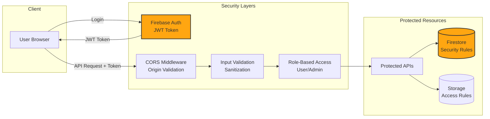
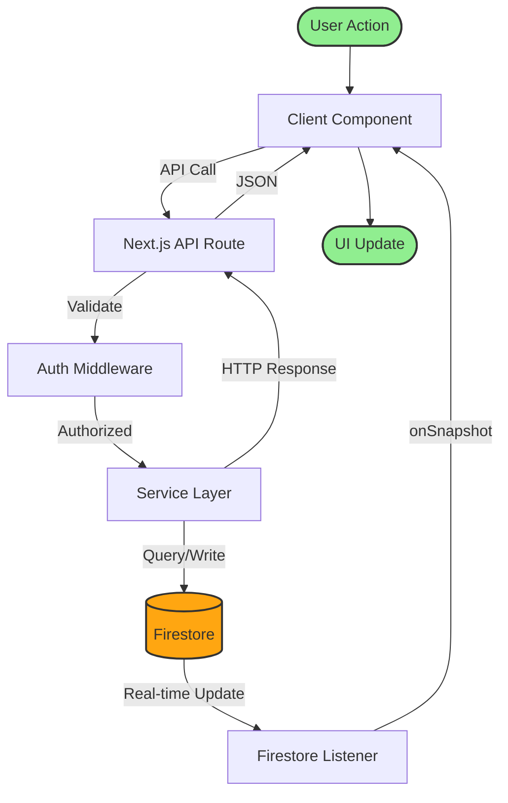
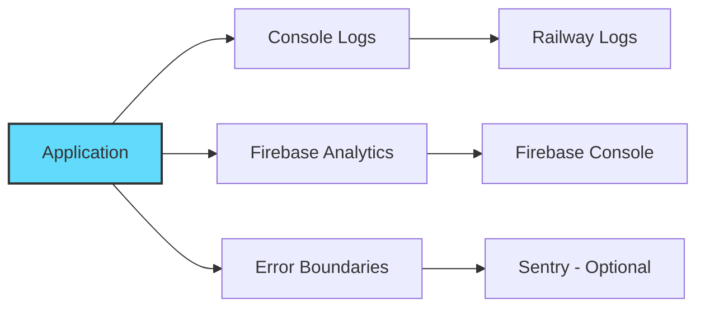

# System Architecture Diagram

## 🏗️ Kiến Trúc Tổng Thể Hệ Thống

Hệ thống GrabTheBeyond được thiết kế theo kiến trúc **Microservices-inspired Monolithic Architecture** với **Event-Driven Real-time Communication**.

---

## 📐 High-Level Architecture

```mermaid
graph TB
    subgraph "Client Layer"
        WEB[Web Browser<br/>Next.js 14 App]
        MOBILE[Mobile Browser<br/>Responsive PWA]
    end

    subgraph "CDN & Edge"
        CDN[Vercel Edge Network<br/>Static Assets + SSR]
        CLOUDINARY[Cloudinary CDN<br/>Image Optimization]
    end

    subgraph "Application Layer"
        subgraph "Next.js Server"
            SSR[Server-Side Rendering<br/>React Server Components]
            API[API Routes<br/>Next.js API Handlers]
            MIDDLEWARE[Middleware<br/>Auth & CORS]
        end
        
        subgraph "Express Backend"
            EXPRESS[Express Server<br/>HTTP + REST API]
            SOCKET[Socket.IO Server<br/>WebSocket Real-time]
            UPLOAD[Multer Middleware<br/>File Upload Handler]
        end
    end

    subgraph "Service Layer"
        AUTH_SVC[Authentication Service<br/>Firebase Auth]
        INCIDENT_SVC[Incident Service<br/>CRUD Operations]
        TRAVEL_SVC[Travel Planner Service<br/>Trip Generation]
        ONLINE_SVC[Online Users Service<br/>Presence Tracking]
        AI_SVC[AI Service<br/>Gemini Integration]
    end

    subgraph "External APIs"
        GEMINI[Google Gemini AI<br/>Conversational AI]
        PLACES[Google Places API<br/>Venue Search]
        WEATHER[OpenWeather API<br/>Weather Data]
        GEOCODE[Nominatim API<br/>Reverse Geocoding]
        GRAB[Grab Deep Link<br/>Ride Booking]
    end

    subgraph "Data Layer"
        subgraph "Firebase Platform"
            FIRESTORE[(Firestore<br/>NoSQL Database)]
            FB_AUTH[Firebase Auth<br/>User Management]
            FB_STORAGE[Firebase Storage<br/>Image Storage]
        end
    end

    subgraph "Real-time Layer"
        REALTIME[Firestore Real-time<br/>Listeners]
        WS[WebSocket<br/>Bidirectional Events]
    end

    %% Client connections
    WEB --> CDN
    MOBILE --> CDN
    CDN --> SSR
    
    %% API connections
    WEB -.WebSocket.-> SOCKET
    MOBILE -.WebSocket.-> SOCKET
    WEB --> API
    MOBILE --> API
    API --> EXPRESS

    %% Middleware
    API --> MIDDLEWARE
    EXPRESS --> UPLOAD

    %% Service connections
    API --> AUTH_SVC
    API --> INCIDENT_SVC
    API --> TRAVEL_SVC
    API --> ONLINE_SVC
    API --> AI_SVC
    
    EXPRESS --> INCIDENT_SVC
    SOCKET --> INCIDENT_SVC
    SOCKET --> ONLINE_SVC

    %% External API calls
    AI_SVC --> GEMINI
    TRAVEL_SVC --> PLACES
    API --> WEATHER
    API --> GEOCODE
    WEB -.DeepLink.-> GRAB

    %% Data layer connections
    AUTH_SVC --> FB_AUTH
    INCIDENT_SVC --> FIRESTORE
    TRAVEL_SVC --> FIRESTORE
    ONLINE_SVC --> FIRESTORE
    UPLOAD --> FB_STORAGE
    
    %% Image upload flow
    WEB -.Upload.-> CLOUDINARY
    INCIDENT_SVC -.ImageURL.-> CLOUDINARY

    %% Real-time connections
    FIRESTORE -.Real-time.-> REALTIME
    REALTIME -.Updates.-> WEB
    SOCKET -.Events.-> WS
    WS -.Broadcast.-> WEB

    style WEB fill:#61dafb,stroke:#333,stroke-width:2px
    style MOBILE fill:#61dafb,stroke:#333,stroke-width:2px
    style FIRESTORE fill:#FFA611,stroke:#333,stroke-width:3px
    style GEMINI fill:#4285f4,stroke:#333,stroke-width:2px
    style SOCKET fill:#010101,stroke:#00ff00,stroke-width:2px
    style REALTIME fill:#FFA611,stroke:#333,stroke-width:2px
```



---

## 🔄 Architecture Layers Explained

### 1. **Client Layer** (Presentation Tier)
- **Technology**: React 18, Next.js 14 App Router, TypeScript
- **Responsibilities**:
  - User interface rendering
  - Client-side state management
  - Form validation
  - Socket.IO client connection
  - Geolocation API integration
  - Speech Recognition (Web API)

### 2. **CDN & Edge Layer** (Content Delivery)
- **Technology**: Vercel Edge Network, Cloudinary
- **Responsibilities**:
  - Static asset caching (JS, CSS, images)
  - Server-Side Rendering at edge locations
  - Image optimization and transformation
  - Global content distribution

### 3. **Application Layer** (Business Logic)

#### Next.js Server
- **Server-Side Rendering (SSR)**: Pre-render pages with user data
- **API Routes**: RESTful endpoints for:
  - `/api/geocode`: Reverse geocoding
  - `/api/weather`: Weather data fetching
  - `/api/users/offline`: Online presence management
  - `/api/incidents/broadcast`: Incident broadcasting
  - `/api/travel-plan/*`: Travel planning endpoints
  - `/api/upload`: File upload handler

#### Express Backend
- **HTTP Server**: REST API for legacy endpoints
- **Socket.IO Server**: Real-time bidirectional communication
- **Multer Middleware**: Multipart form data handling

### 4. **Service Layer** (Domain Services)

| Service | File | Responsibilities |
|---------|------|-----------------|
| **Auth Service** | `lib/authService.ts` | Login, signup, session management |
| **Incident Service** | `lib/incidentServiceFirebase.ts` | Create, read, update incidents |
| **Travel Service** | `lib/travelPlanService.ts` | Generate trip plans, save itineraries |
| **Online Users** | `lib/onlineUsersService.ts` | Heartbeat tracking, presence |
| **AI Service** | `lib/geminiAI.ts` | Gemini API integration, prompt engineering |
| **Places Service** | `lib/placesAPI.ts` | Google Places search, venue details |

### 5. **External APIs Layer**
- **Google Gemini AI**: Context-aware chatbot responses
- **Google Places API**: Venue search, reviews, ratings
- **OpenWeather API**: Current weather, forecasts
- **Nominatim API**: Lat/long to address conversion
- **Grab Deep Link**: Mobile app integration

### 6. **Data Layer** (Persistence)

#### Firebase Firestore Collections:
```
firestore/
├── users/               # User profiles
├── incidents/           # Reported incidents
├── travel_plans/        # Generated trip plans
├── online_users/        # Current online users (TTL)
└── chat_history/        # AI conversation logs
```

#### Firebase Storage:
```
storage/
└── incident_images/     # Uploaded incident photos
```

### 7. **Real-time Layer** (Event-Driven)

#### Socket.IO Events:
- `incident:new`: New incident reported
- `incident:update`: Incident status changed
- `user:online`: User came online
- `user:offline`: User went offline

#### Firestore Listeners:
- `onSnapshot(incidents)`: Real-time incident updates
- `onSnapshot(online_users)`: Real-time user count
- `onSnapshot(travel_plans)`: Trip plan updates

---

## 🔐 Security Architecture



### Security Measures:
1. **Authentication**: Firebase Auth with JWT tokens
2. **Authorization**: Firestore Security Rules
3. **CORS**: Configured origin whitelist
4. **Input Validation**: Server-side validation for all inputs
5. **XSS Prevention**: React auto-escaping, sanitized user inputs
6. **CSRF Protection**: SameSite cookies, token validation
7. **Rate Limiting**: API throttling (planned)
8. **Secure Storage**: HTTPS-only, signed URLs for images

---

## 📊 Data Flow Architecture



---

## 🚀 Deployment Architecture

```mermaid
graph TB
    subgraph "Production Environment"
        subgraph "Vercel Platform"
            EDGE[Edge Functions<br/>Global CDN]
            NEXTJS[Next.js App<br/>Serverless Functions]
        end

        subgraph "Railway Platform"
            EXPRESS_PROD[Express Server<br/>Container]
            SOCKET_PROD[Socket.IO<br/>WebSocket]
        end

        subgraph "Firebase Cloud"
            FIRESTORE_PROD[(Firestore<br/>Multi-region)]
            AUTH_PROD[Authentication<br/>Global)]
            STORAGE_PROD[Storage<br/>US/Asia)]
        end

        subgraph "External Services"
            GEMINI_PROD[Gemini AI<br/>Google Cloud]
            PLACES_PROD[Places API<br/>Google Cloud]
        end
    end

    EDGE --> NEXTJS
    NEXTJS --> EXPRESS_PROD
    NEXTJS --> FIRESTORE_PROD
    EXPRESS_PROD --> SOCKET_PROD
    EXPRESS_PROD --> FIRESTORE_PROD
    NEXTJS --> AUTH_PROD
    NEXTJS --> GEMINI_PROD
    NEXTJS --> PLACES_PROD
    EXPRESS_PROD --> STORAGE_PROD

    style FIRESTORE_PROD fill:#FFA611,stroke:#333,stroke-width:3px
    style NEXTJS fill:#000,stroke:#fff,stroke-width:2px
```

---

## 📈 Scalability Considerations

### Horizontal Scaling:
- ✅ **Stateless API**: Next.js API routes can scale horizontally
- ✅ **Firestore**: Auto-scales with load
- ⚠️ **Socket.IO**: Requires Redis adapter for multi-instance (future)

### Vertical Scaling:
- **Express Server**: Can be upgraded to larger containers
- **Firebase**: Automatic based on usage tier

### Performance Optimizations:
1. **Code Splitting**: Next.js automatic route-based splitting
2. **Image Optimization**: Next.js Image component + Cloudinary
3. **Caching**: Firestore client-side cache, CDN caching
4. **Lazy Loading**: React.lazy() for heavy components
5. **Memoization**: React.memo(), useMemo() for expensive renders

---

## 🔍 Monitoring & Observability



### Monitoring Tools:
- **Firebase Console**: User analytics, crash reports
- **Railway Logs**: Server logs, error tracking
- **Browser DevTools**: Network, performance profiling
- **Lighthouse**: Performance audits

---

**Architecture Version**: 1.0  
**Last Updated**: December 2025  
**Status**: Production-Ready

