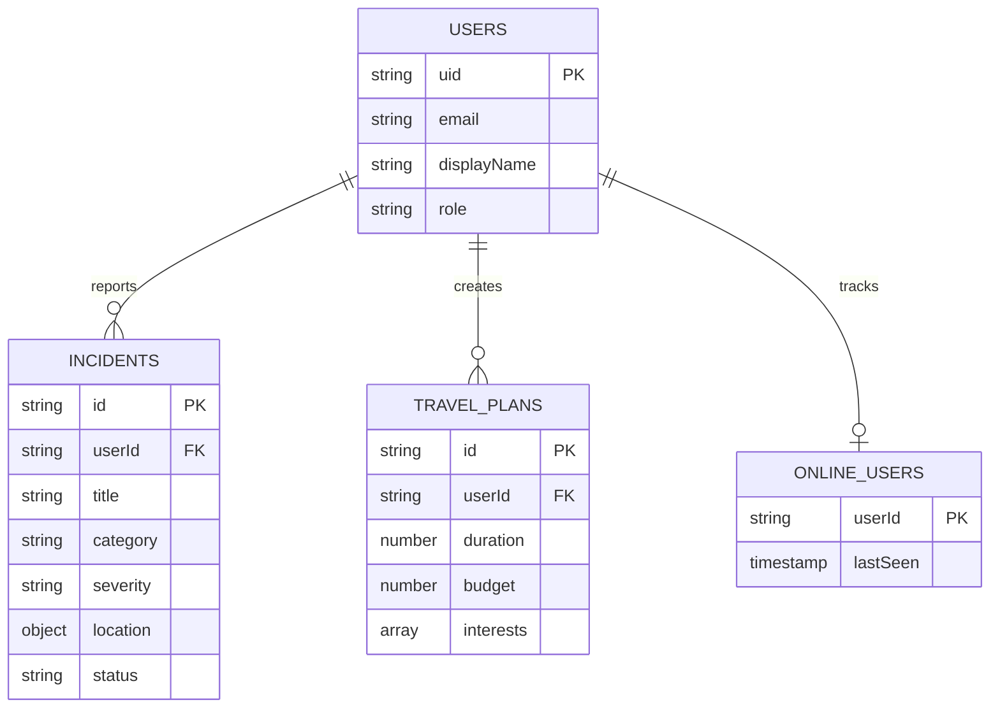

# Database Design & Schema

## 🗄️ Firestore Database Architecture

GrabTheBeyond sử dụng **Firebase Firestore** - một NoSQL document-oriented database với khả năng real-time synchronization.

---

## 📊 Entity-Relationship Diagram



---

## 📁 Firestore Collections Structure

### 1. **users** Collection

```typescript
{
  uid: string;                    // Firebase Auth UID (Document ID)
  email: string;                  // Unique email
  displayName: string;            // User's full name
  photoURL?: string;              // Profile picture
  role: 'user' | 'admin';         // Authorization role
  createdAt: Timestamp;           // Registration date
  lastLogin: Timestamp;           // Last login
  location?: {
    lat: number;
    lng: number;
    address: string;
    city: string;
  };
  preferences?: string[];         // ['beach', 'food', 'culture']
  stats?: {
    incidentsReported: number;
    tripsPlanned: number;
  };
}
```

**Indexes:**
- `email` (Ascending) - For login lookups
- `role` (Ascending) - For admin queries
- `createdAt` (Descending) - For newest users

**Security Rules:**
```javascript
match /users/{userId} {
  allow read: if request.auth != null;
  allow write: if request.auth.uid == userId;
  allow create: if request.auth != null;
}
```

---

### 2. **incidents** Collection

```typescript
{
  id: string;                     // Auto-generated (Document ID)
  userId: string;                 // Reporter's UID
  userEmail?: string;             // Reporter's email
  userName?: string;              // Reporter's name
  title: string;                  // "Flooding on Nguyen Van Linh Street"
  description: string;            // Detailed description
  category: IncidentCategory;     // See enum below
  severity: 'low' | 'medium' | 'high' | 'critical';
  location: {
    lat: number;                  // Latitude
    lng: number;                  // Longitude
    address: string;              // Reverse geocoded address
    city: string;                 // "Da Nang"
  };
  imageUrl?: string;              // Cloudinary URL
  status: 'pending' | 'verified' | 'resolved' | 'false_report';
  reportedAt: Timestamp;          // When reported
  updatedAt: Timestamp;           // Last update
  resolvedAt?: Timestamp;         // When resolved
  viewCount: number;              // View statistics
  tags: string[];                 // ['urgent', 'road', 'traffic']
  metadata?: {
    ipAddress?: string;
    userAgent?: string;
    source: 'web' | 'mobile';
  };
}
```

**IncidentCategory Enum:**
```typescript
type IncidentCategory = 
  | 'accident'        // Traffic accident
  | 'construction'    // Road construction
  | 'flood'           // Flooding
  | 'road_damage'     // Pothole, damaged road
  | 'traffic_jam'     // Heavy traffic
  | 'protest'         // Public gathering
  | 'weather'         // Storm, heavy rain
  | 'other';          // Other incidents
```

**Indexes:**
- Composite: `(status, reportedAt DESC)`
- Composite: `(category, severity, reportedAt DESC)`
- Composite: `(userId, reportedAt DESC)`
- GeoPoint: `location` (for geoqueries - requires GeoFirestore)

**Security Rules:**
```javascript
match /incidents/{incidentId} {
  allow read: if true;  // Public read
  allow create: if request.auth != null;
  allow update: if request.auth != null && 
                (request.auth.uid == resource.data.userId || 
                 get(/databases/$(database)/documents/users/$(request.auth.uid)).data.role == 'admin');
  allow delete: if get(/databases/$(database)/documents/users/$(request.auth.uid)).data.role == 'admin';
}
```

---

### 3. **travel_plans** Collection

```typescript
{
  id: string;                     // Auto-generated
  userId: string;                 // Creator's UID
  title: string;                  // "3-Day Da Nang Beach Getaway"
  duration: number;               // Number of days (e.g., 3)
  budget: number;                 // Total budget in VND
  people: number;                 // Number of travelers
  interests: string[];            // ['beach', 'food', 'nightlife']
  startLocation?: {
    lat: number;
    lng: number;
    address: string;
  };
  dailyItineraries: DailyItinerary[];  // See below
  createdAt: Timestamp;
  updatedAt: Timestamp;
  status: 'draft' | 'published' | 'completed';
  metadata?: {
    generatedBy: 'ai' | 'manual';
    aiModel?: string;             // 'gemini-pro'
    prompt?: string;              // Original user prompt
  };
}
```

**DailyItinerary Schema:**
```typescript
interface DailyItinerary {
  day: number;                    // Day 1, 2, 3...
  date?: string;                  // "2025-12-20"
  theme: string;                  // "Beach & Relaxation"
  activities: Activity[];
  estimatedCost: number;          // Daily budget
  transportation?: {
    method: 'grab' | 'bus' | 'motorbike' | 'walk';
    cost: number;
  };
}

interface Activity {
  id: string;
  name: string;                   // "My Khe Beach"
  placeId?: string;               // Google Places ID
  category: string;               // 'beach', 'restaurant', 'attraction'
  location: {
    lat: number;
    lng: number;
    address: string;
  };
  timeSlot: 'morning' | 'afternoon' | 'evening' | 'night';
  duration: number;               // Minutes
  estimatedCost: number;
  description: string;
  rating?: number;                // Google rating (1-5)
  photos?: string[];              // Image URLs
  openingHours?: string;
  tips?: string;                  // AI-generated tips
}
```

**Indexes:**
- `userId, createdAt DESC`
- `status, createdAt DESC`
- `budget ASC, duration ASC`

---

### 4. **online_users** Collection (Ephemeral)

```typescript
{
  userId: string;                 // User ID (Document ID)
  lastSeen: Timestamp;            // Last heartbeat
  online: boolean;                // true
}
```

**TTL (Time-to-Live):** 60 seconds (cleanup via Cloud Functions or client-side)

**Security Rules:**
```javascript
match /online_users/{userId} {
  allow read: if true;  // Public read for counter
  allow write: if request.auth.uid == userId;
}
```

---

### 5. **chat_history** Collection (Optional)

```typescript
{
  id: string;                     // Auto-generated
  userId: string;                 // User ID
  sessionId: string;              // Conversation session UUID
  role: 'user' | 'assistant' | 'system';
  content: string;                // Message text
  metadata?: {
    model: string;                // 'gemini-1.5-pro'
    tokens: number;
    latency: number;              // Response time (ms)
    attachments?: string[];       // Image URLs
  };
  createdAt: Timestamp;
}
```

**Indexes:**
- `userId, sessionId, createdAt ASC`

---

## 🔥 Firestore Security Rules (Complete)

```javascript
rules_version = '2';
service cloud.firestore {
  match /databases/{database}/documents {
    
    // Helper functions
    function isSignedIn() {
      return request.auth != null;
    }
    
    function isOwner(userId) {
      return request.auth.uid == userId;
    }
    
    function isAdmin() {
      return isSignedIn() && 
             get(/databases/$(database)/documents/users/$(request.auth.uid)).data.role == 'admin';
    }
    
    // Users collection
    match /users/{userId} {
      allow read: if isSignedIn();
      allow create: if isSignedIn() && isOwner(userId);
      allow update: if isOwner(userId) || isAdmin();
      allow delete: if isAdmin();
    }
    
    // Incidents collection
    match /incidents/{incidentId} {
      allow read: if true;  // Public read
      allow create: if isSignedIn() && 
                    request.resource.data.userId == request.auth.uid;
      allow update: if isSignedIn() && 
                    (isOwner(resource.data.userId) || isAdmin());
      allow delete: if isAdmin();
    }
    
    // Travel plans collection
    match /travel_plans/{planId} {
      allow read: if isSignedIn();
      allow create: if isSignedIn() && 
                    request.resource.data.userId == request.auth.uid;
      allow update: if isOwner(resource.data.userId);
      allow delete: if isOwner(resource.data.userId) || isAdmin();
    }
    
    // Online users collection
    match /online_users/{userId} {
      allow read: if true;  // Public for counter
      allow write: if isOwner(userId);
    }
    
    // Chat history collection
    match /chat_history/{messageId} {
      allow read: if isSignedIn() && 
                  isOwner(resource.data.userId);
      allow create: if isSignedIn() && 
                    request.resource.data.userId == request.auth.uid;
      allow update, delete: if false;  // Immutable
    }
  }
}
```

---

## 📈 Data Access Patterns

### 1. **Incident Queries**
```typescript
// Get recent incidents
const q = query(
  collection(db, 'incidents'),
  where('status', '==', 'verified'),
  orderBy('reportedAt', 'desc'),
  limit(50)
);

// Get incidents by category
const q = query(
  collection(db, 'incidents'),
  where('category', '==', 'flood'),
  where('severity', 'in', ['high', 'critical']),
  orderBy('reportedAt', 'desc')
);

// Real-time listener
const unsubscribe = onSnapshot(q, (snapshot) => {
  snapshot.docChanges().forEach((change) => {
    if (change.type === 'added') {
      // New incident
    }
  });
});
```

### 2. **Travel Plan Queries**
```typescript
// Get user's travel plans
const q = query(
  collection(db, 'travel_plans'),
  where('userId', '==', currentUser.uid),
  orderBy('createdAt', 'desc')
);

// Search by budget range
const q = query(
  collection(db, 'travel_plans'),
  where('budget', '>=', 1000000),
  where('budget', '<=', 5000000),
  orderBy('budget', 'asc')
);
```

### 3. **Online Users Count**
```typescript
const q = query(collection(db, 'online_users'));
const unsubscribe = onSnapshot(q, (snapshot) => {
  const count = snapshot.size;
  setOnlineUsers(count);
});
```

---

## 💾 Data Migration & Backup

### Backup Strategy:
1. **Automated Daily Backups**: Firebase automatic backups (Blaze plan)
2. **Export to BigQuery**: Weekly exports for analytics
3. **Manual Exports**: `firestore-export` for critical collections

### Migration Scripts:
```bash
# Export collection
npx firestore-export --accountCredentials serviceAccountKey.json \
  --backupFile backup.json --nodePath "incidents"

# Import collection
npx firestore-import --accountCredentials serviceAccountKey.json \
  --backupFile backup.json --nodePath "incidents"
```

---

## 🔍 Query Performance Optimization

### Indexes Required:
```json
{
  "indexes": [
    {
      "collectionGroup": "incidents",
      "queryScope": "COLLECTION",
      "fields": [
        { "fieldPath": "status", "order": "ASCENDING" },
        { "fieldPath": "reportedAt", "order": "DESCENDING" }
      ]
    },
    {
      "collectionGroup": "incidents",
      "queryScope": "COLLECTION",
      "fields": [
        { "fieldPath": "category", "order": "ASCENDING" },
        { "fieldPath": "severity", "order": "ASCENDING" },
        { "fieldPath": "reportedAt", "order": "DESCENDING" }
      ]
    },
    {
      "collectionGroup": "travel_plans",
      "queryScope": "COLLECTION",
      "fields": [
        { "fieldPath": "userId", "order": "ASCENDING" },
        { "fieldPath": "createdAt", "order": "DESCENDING" }
      ]
    }
  ]
}
```

Save as `firestore.indexes.json` and deploy:
```bash
firebase deploy --only firestore:indexes
```

---

**Database Version**: 1.0  
**Schema Last Updated**: December 2025  
**Firestore Rules Version**: 2

