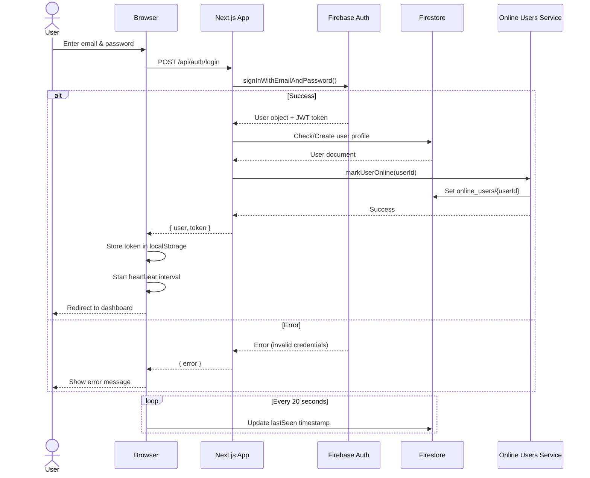
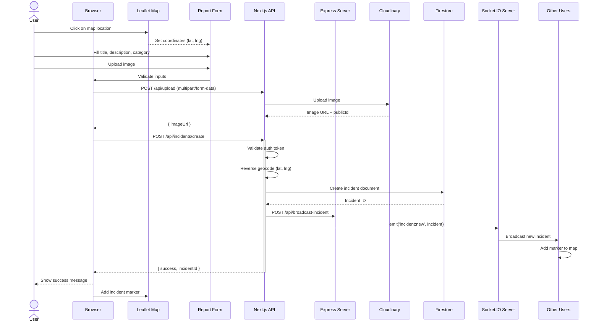
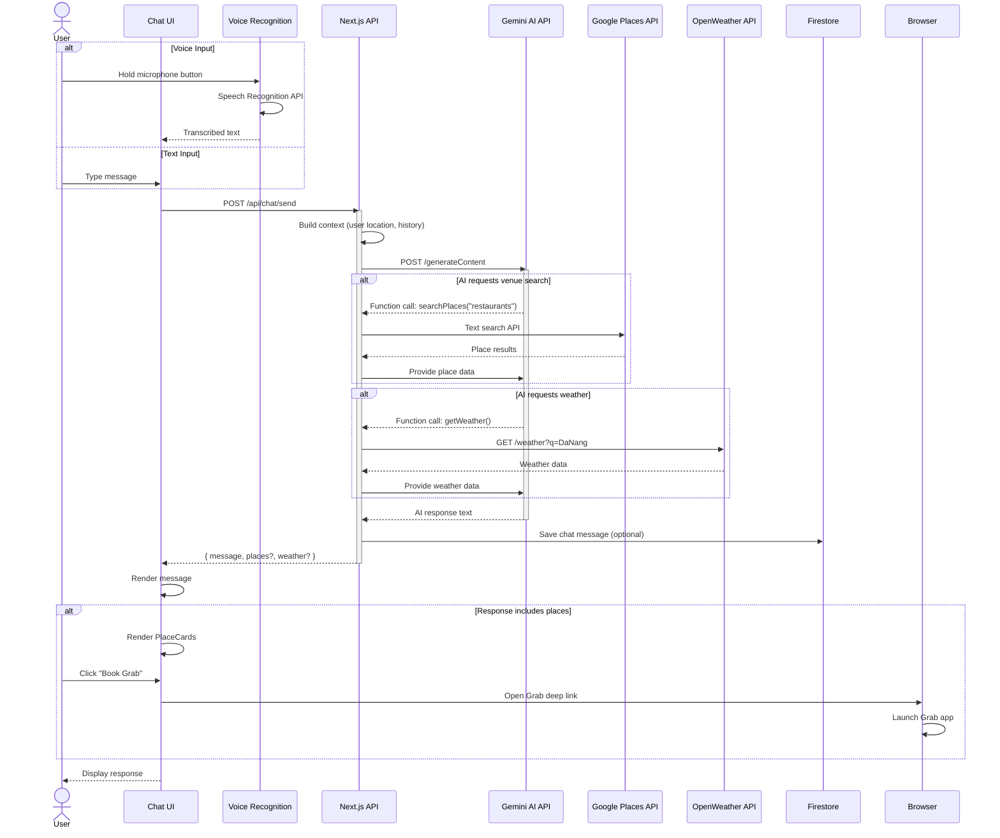
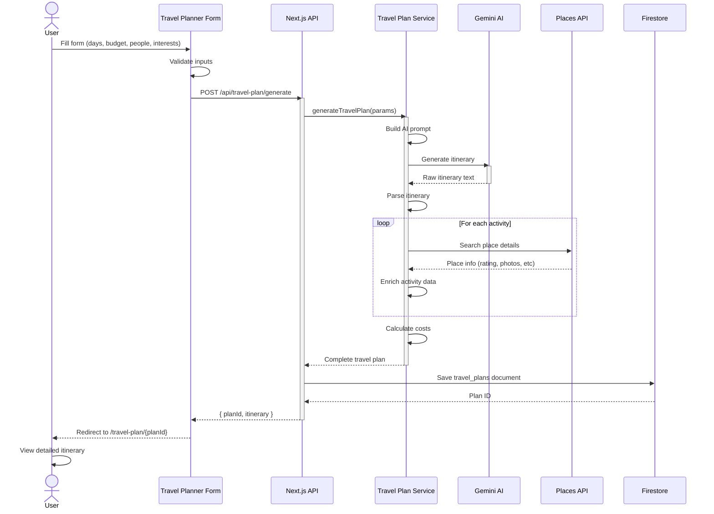
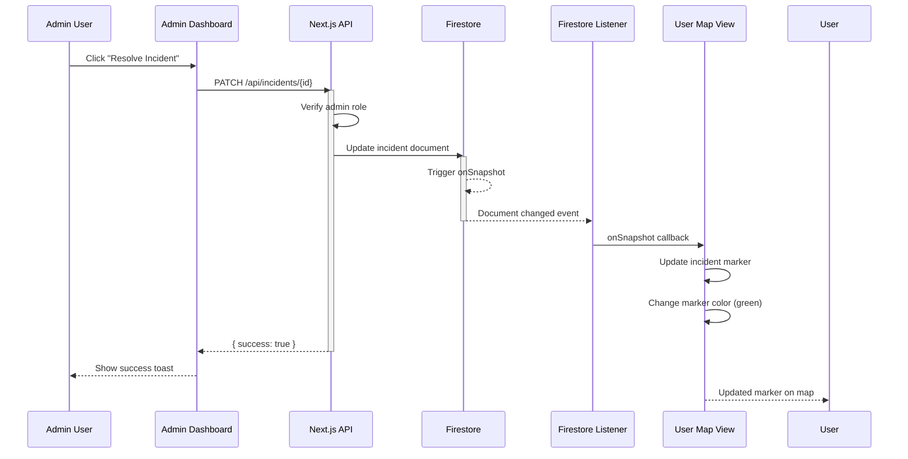
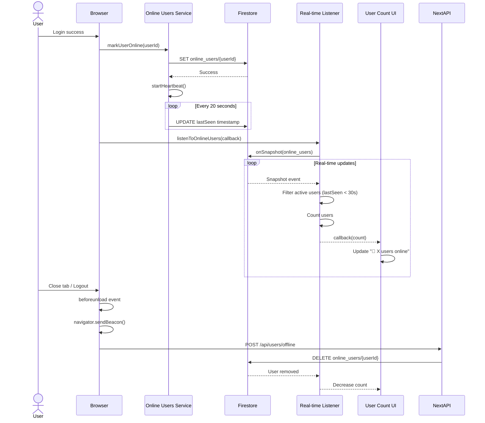
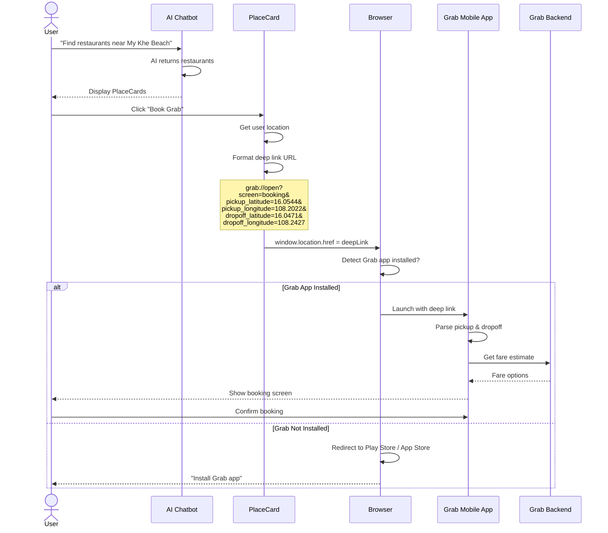
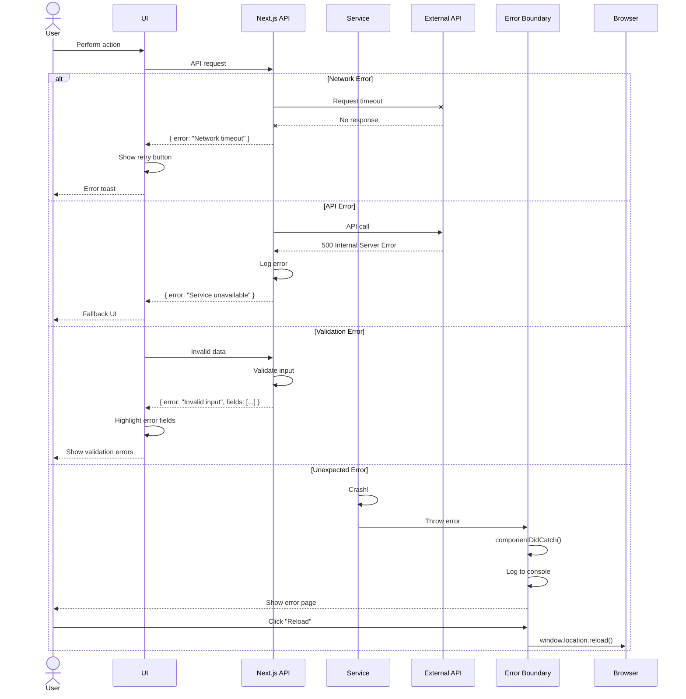
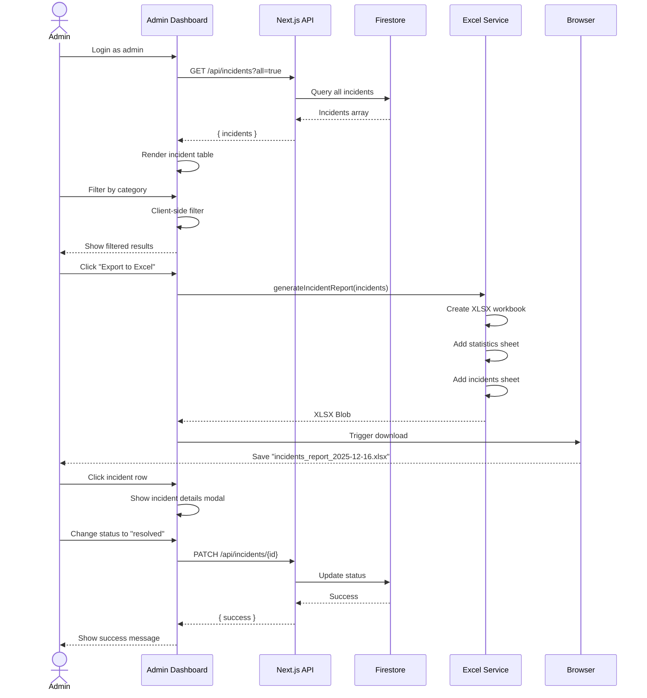
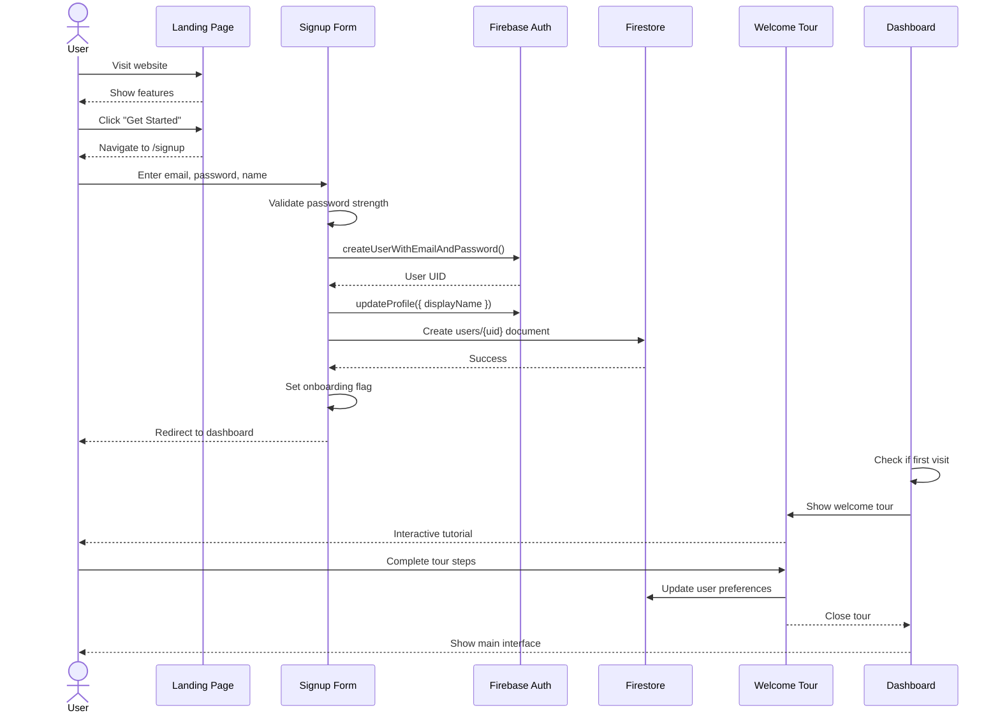

# Sequence Diagrams

## 🔄 Detailed System Flows

Tài liệu này mô tả các luồng xử lý chính trong hệ thống GrabTheBeyond thông qua Sequence Diagrams.

---

## 1. User Authentication Flow

---

## 2. Report Incident Flow (with Image Upload)

---

## 3. AI Chatbot Conversation Flow

---

## 4. Travel Plan Generation Flow

---

## 5. Real-time Incident Updates Flow

---

## 6. Online Users Tracking Flow

---

## 7. Grab Integration Flow

---

## 8. Error Handling Flow

---

## 9. Admin Dashboard - Incident Management

---

## 10. First-Time User Onboarding

---

**Sequence Diagrams Version**: 1.0  
**Last Updated**: December 2025  
**UML Standard**: UML 2.5

