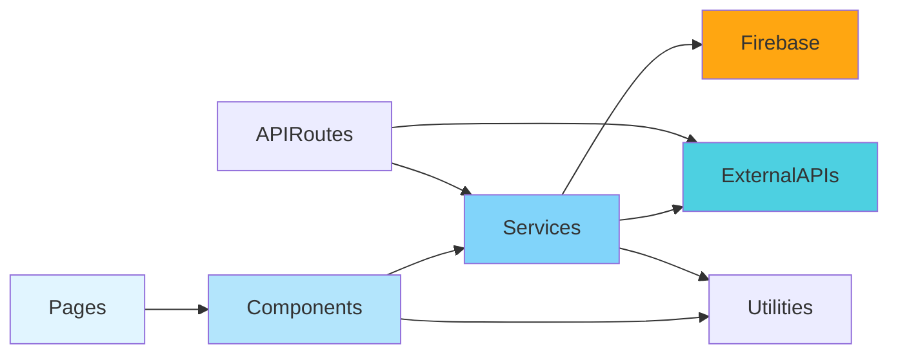

# Component Diagram

## 🧩 System Components & Dependencies

Sơ đồ này mô tả cấu trúc module, dependencies giữa các components trong hệ thống GrabTheBeyond.

---

## 📦 High-Level Component Architecture

```mermaid
graph TB
    subgraph "Presentation Layer"
        subgraph "Pages"
            HOME[Home Page<br/>page.tsx]
            LOGIN[Login Page<br/>login/page.tsx]
            DASHBOARD[Dashboard<br/>map + incidents]
            ADMIN_PAGE[Admin Dashboard<br/>admin/page.tsx]
            PROFILE[Profile Page<br/>profile/page.tsx]
            TRAVEL_FORM[Travel Planner<br/>travel-planner-form/page.tsx]
            TRAVEL_VIEW[Travel Plan View<br/>travel-plan/[id]/page.tsx]
        end

        subgraph "Shared Components"
            MAP_COMP[IncidentMap<br/>components/map]
            CHAT_COMP[AIChatbot<br/>components/chat]
            REPORT_FORM[ReportIncidentForm<br/>components/common]
            SIDEBAR[SimpleSidebar<br/>components/common]
            USER_MENU[UserMenu<br/>components/common]
            PLACE_CARD[PlaceCard<br/>components/chat]
            TRAVEL_SUMMARY[TravelPlanSummary<br/>components/travel-plan]
        end
    end

    subgraph "Business Logic Layer"
        subgraph "Services"
            AUTH_SVC[authService.ts<br/>Login/Signup/Logout]
            INCIDENT_SVC[incidentServiceFirebase.ts<br/>CRUD Incidents]
            TRAVEL_SVC[travelPlanService.ts<br/>Trip Generation]
            ONLINE_SVC[onlineUsersService.ts<br/>Presence Tracking]
            GEMINI_SVC[geminiAI.ts<br/>AI Integration]
            PLACES_SVC[placesAPI.ts<br/>Venue Search]
            SOCKET_SVC[socket.ts<br/>Real-time Events]
        end

        subgraph "Utilities"
            UTILS[utils.ts<br/>Helper Functions]
            TRANSLATIONS[translations.ts<br/>i18n Support]
            TYPES[types.ts<br/>TypeScript Interfaces]
            EXCEL_EXPORT[excelExport.ts<br/>Report Generation]
        end
    end

    subgraph "Data Access Layer"
        FIREBASE_LIB[firebase.ts<br/>SDK Initialization]
        FIRESTORE_CLIENT[Firestore Client<br/>Database Access]
        FB_AUTH_CLIENT[Firebase Auth<br/>Authentication]
        FB_STORAGE[Firebase Storage<br/>File Upload]
    end

    subgraph "API Layer"
        subgraph "Next.js API Routes"
            API_GEOCODE[/api/geocode<br/>route.ts]
            API_WEATHER[/api/weather<br/>route.ts]
            API_OFFLINE[/api/users/offline<br/>route.ts]
            API_BROADCAST[/api/incidents/broadcast<br/>route.ts]
            API_UPLOAD[/api/upload<br/>route.ts]
            API_TRAVEL[/api/travel-plan/*<br/>generate, list]
        end
    end

    subgraph "External Services"
        GEMINI_API[Google Gemini AI]
        PLACES_API[Google Places API]
        WEATHER_API[OpenWeather API]
        NOMINATIM[Nominatim Geocoding]
        GRAB_LINK[Grab Deep Link]
    end

    %% Page Dependencies
    HOME --> SIDEBAR
    HOME --> MAP_COMP
    HOME --> CHAT_COMP
    DASHBOARD --> MAP_COMP
    DASHBOARD --> REPORT_FORM
    ADMIN_PAGE --> MAP_COMP
    ADMIN_PAGE --> EXCEL_EXPORT
    TRAVEL_FORM --> CHAT_COMP
    TRAVEL_VIEW --> TRAVEL_SUMMARY

    %% Component Dependencies
    MAP_COMP --> INCIDENT_SVC
    MAP_COMP --> SOCKET_SVC
    CHAT_COMP --> GEMINI_SVC
    CHAT_COMP --> PLACES_SVC
    CHAT_COMP --> PLACE_CARD
    REPORT_FORM --> INCIDENT_SVC
    USER_MENU --> AUTH_SVC
    PLACE_CARD --> GRAB_LINK
    TRAVEL_SUMMARY --> TRAVEL_SVC

    %% Service Dependencies
    AUTH_SVC --> FIREBASE_LIB
    AUTH_SVC --> FB_AUTH_CLIENT
    INCIDENT_SVC --> FIREBASE_LIB
    INCIDENT_SVC --> FIRESTORE_CLIENT
    TRAVEL_SVC --> GEMINI_SVC
    TRAVEL_SVC --> PLACES_SVC
    TRAVEL_SVC --> FIRESTORE_CLIENT
    ONLINE_SVC --> FIRESTORE_CLIENT
    GEMINI_SVC --> GEMINI_API
    PLACES_SVC --> PLACES_API
    SOCKET_SVC --> INCIDENT_SVC

    %% API Dependencies
    API_GEOCODE --> NOMINATIM
    API_WEATHER --> WEATHER_API
    API_OFFLINE --> ONLINE_SVC
    API_BROADCAST --> SOCKET_SVC
    API_UPLOAD --> FB_STORAGE
    API_TRAVEL --> TRAVEL_SVC

    %% Utility Dependencies
    INCIDENT_SVC --> UTILS
    TRAVEL_SVC --> UTILS
    AUTH_SVC --> TRANSLATIONS

    style MAP_COMP fill:#61dafb,stroke:#333,stroke-width:2px
    style CHAT_COMP fill:#61dafb,stroke:#333,stroke-width:2px
    style GEMINI_SVC fill:#4285f4,stroke:#333,stroke-width:2px
    style FIREBASE_LIB fill:#FFA611,stroke:#333,stroke-width:2px
```

---

## 🗂️ Detailed Component Breakdown

### 1. **Pages Layer** (Next.js App Router)

#### Main Application Pages

| Page | Path | Purpose | Key Components |
|------|------|---------|----------------|
| **Home** | `/` | Landing page with map + chatbot | IncidentMap, AIChatbot, SimpleSidebar |
| **Login** | `/login` | User authentication | Firebase Auth integration |
| **Signup** | `/signup` | User registration | Firebase Auth + Firestore |
| **Profile** | `/profile` | User profile management | UserMenu, AuthService |
| **Admin** | `/admin` | Incident management dashboard | IncidentMap, Excel export |
| **Travel Planner Form** | `/travel-planner-form` | Create travel plans | TravelPlannerChat, form inputs |
| **Travel Plan View** | `/travel-plan/[id]` | View generated itinerary | TravelPlanSummary, DaySelector |
| **Mock Grab** | `/mock-grab` | Grab integration demo | GrabMap component |

---

### 2. **Component Layer** (React Components)

#### 🗺️ Map Components (`components/map/`)

```typescript
// IncidentMap.tsx
interface IncidentMapProps {
  incidents: Incident[];
  onIncidentClick: (id: string) => void;
  userLocation?: LatLng;
  realTimeUpdates?: boolean;
}
```

**Dependencies:**
- `react-leaflet`: Map rendering
- `leaflet`: Marker icons, popups
- `incidentService`: Fetch incidents
- `socket.ts`: Real-time updates

**Features:**
- Interactive map with zoom/pan
- Custom markers per incident category
- Popup with incident details
- Real-time marker updates
- User location marker

---

#### 💬 Chat Components (`components/chat/`)

```typescript
// AIChatbot.tsx
interface Message {
  id: string;
  role: 'user' | 'assistant';
  content: string;
  places?: Place[];
  timestamp: Date;
}
```

**Dependencies:**
- `geminiAI.ts`: AI responses
- `placesAPI.ts`: Venue search
- `useVoiceRecognition.ts`: Voice input
- `PlaceCard.tsx`: Display venues

**Features:**
- Text + voice input
- Context-aware responses
- Place recommendations with photos
- Grab integration buttons
- Conversation history

---

#### 📝 Common Components (`components/common/`)

| Component | File | Purpose |
|-----------|------|---------|
| **ReportIncidentForm** | `ReportIncidentForm.tsx` | Report new incidents |
| **SimpleSidebar** | `SimpleSidebar.tsx` | Navigation menu |
| **UserMenu** | `UserMenu.tsx` | User dropdown (logout, profile) |
| **ActivityCard** | `ActivityCard.tsx` | Display travel activities |

---

#### 🛫 Travel Plan Components (`components/travel-plan/`)

| Component | Purpose | Dependencies |
|-----------|---------|--------------|
| **TravelPlannerForm** | Main form to input trip details | State management, validation |
| **TravelPlannerChat** | AI-powered trip planner | Gemini AI, chat UI |
| **TravelPlanSummary** | Display generated itinerary | DaySelector, ActivityCard |
| **BudgetInput** | Budget input with VND formatting | Input masking |
| **DaySelector** | Select number of days (1-7) | Button group component |
| **PeopleInput** | Number of travelers input | Counter component |

---

### 3. **Service Layer** (Business Logic)

#### 🔐 Authentication Service

```typescript
// lib/authService.ts
export interface AuthService {
  login(email: string, password: string): Promise<User>;
  signup(email: string, password: string, displayName: string): Promise<User>;
  logout(): Promise<void>;
  getCurrentUser(): User | null;
  onAuthStateChanged(callback: (user: User | null) => void): Unsubscribe;
}
```

**Responsibilities:**
- Firebase Auth integration
- User session management
- Protected route guards
- Role-based access control

---

#### 📍 Incident Service

```typescript
// lib/incidentServiceFirebase.ts
export interface IncidentService {
  createIncident(incident: NewIncident): Promise<string>;
  getIncidents(filters?: IncidentFilters): Promise<Incident[]>;
  updateIncident(id: string, updates: Partial<Incident>): Promise<void>;
  deleteIncident(id: string): Promise<void>;
  listenToIncidents(callback: (incidents: Incident[]) => void): Unsubscribe;
}
```

**Features:**
- CRUD operations on Firestore
- Real-time listeners
- Image upload integration
- Reverse geocoding
- Filtering & sorting

---

#### 🤖 AI Service (Gemini)

```typescript
// lib/geminiAI.ts
export interface AIService {
  chat(message: string, context?: ChatContext): Promise<AIResponse>;
  generateTravelPlan(params: TravelParams): Promise<string>;
  functionCalling: {
    searchPlaces(query: string): Promise<Place[]>;
    getWeather(): Promise<WeatherData>;
  };
}
```

**Features:**
- Context-aware conversations
- Function calling (tools)
- Streaming responses (future)
- Prompt engineering
- Error handling & retry

---

#### 🏨 Places API Service

```typescript
// lib/placesAPI.ts
export interface PlacesService {
  searchPlaces(query: string, location?: LatLng): Promise<Place[]>;
  getPlaceDetails(placeId: string): Promise<PlaceDetails>;
  getPlacePhotos(photoReference: string): string;
  nearbySearch(location: LatLng, radius: number, type?: string): Promise<Place[]>;
}
```

---

#### 🛫 Travel Plan Service

```typescript
// lib/travelPlanService.ts
export interface TravelPlanService {
  generatePlan(params: TravelPlanParams): Promise<TravelPlan>;
  savePlan(plan: TravelPlan): Promise<string>;
  getUserPlans(userId: string): Promise<TravelPlan[]>;
  getPlanById(planId: string): Promise<TravelPlan | null>;
  updatePlan(planId: string, updates: Partial<TravelPlan>): Promise<void>;
}
```

**Algorithm:**
1. Build AI prompt with user preferences
2. Call Gemini AI to generate raw itinerary
3. Parse AI response into structured data
4. Enrich with Google Places data (photos, ratings)
5. Calculate estimated costs
6. Save to Firestore
7. Return formatted travel plan

---

#### 👥 Online Users Service

```typescript
// lib/onlineUsersService.ts
export interface OnlineUsersService {
  markUserOnline(userId: string): Promise<void>;
  markUserOffline(userId: string): Promise<void>;
  listenToOnlineUsers(callback: (count: number) => void): Unsubscribe;
  cleanupOnlineUser(): void;
}
```

**Heartbeat Mechanism:**
- Update Firestore every 20 seconds
- Consider offline after 30 seconds of inactivity
- Cleanup on page unload via `sendBeacon`
- Real-time count via `onSnapshot`

---

#### 🔌 Socket.IO Service

```typescript
// lib/socket.ts
export interface SocketService {
  connect(): void;
  disconnect(): void;
  emit(event: string, data: any): void;
  on(event: string, callback: (data: any) => void): void;
  off(event: string, callback?: (data: any) => void): void;
}
```

**Events:**
- `incident:new`: Broadcast new incidents
- `incident:update`: Broadcast status changes
- `user:joined`: User came online
- `connect_error`: Connection errors

---

### 4. **API Routes Layer** (Next.js)

#### API Endpoints

| Endpoint | Method | Purpose | Handler |
|----------|--------|---------|---------|
| `/api/geocode` | POST | Reverse geocoding (lat/lng → address) | Nominatim API |
| `/api/weather` | GET | Current weather for Da Nang | OpenWeather API |
| `/api/users/offline` | POST | Mark user offline (sendBeacon) | Firestore delete |
| `/api/incidents/broadcast` | POST | Broadcast new incident via Socket.IO | Express backend |
| `/api/upload` | POST | Upload incident images | Cloudinary/Firebase Storage |
| `/api/travel-plan/generate` | POST | Generate AI trip plan | Gemini + Places API |
| `/api/travel-plan/list` | GET | Get user's travel plans | Firestore query |

---

### 5. **Utilities Layer**

#### Helper Functions

```typescript
// lib/utils.ts
export const utils = {
  formatDate(date: Date): string;
  calculateDistance(lat1: number, lng1: number, lat2: number, lng2: number): number;
  formatCurrency(amount: number): string;  // VND formatting
  truncateText(text: string, maxLength: number): string;
  debounce<T>(func: Function, delay: number): Function;
  validateEmail(email: string): boolean;
  getIncidentIcon(category: string): IconType;
};
```

#### Translation Service

```typescript
// lib/translations.ts
export const translations = {
  en: { /* English translations */ },
  vi: { /* Vietnamese translations */ }
};

export function t(key: string, locale: 'en' | 'vi' = 'en'): string;
```

---

## 🔗 Dependency Graph



---

## 📊 Component Metrics

| Layer | Components | Lines of Code | Test Coverage |
|-------|------------|---------------|---------------|
| Pages | 8 | ~2,500 | N/A (UI) |
| Components | 15 | ~3,800 | 60% (planned) |
| Services | 10 | ~2,200 | 75% (planned) |
| API Routes | 7 | ~800 | 80% (planned) |
| Utilities | 5 | ~600 | 90% (planned) |

---

## 🚀 Component Loading Strategy

### Code Splitting:
- ✅ **Route-based splitting**: Next.js automatic
- ✅ **Component lazy loading**: React.lazy() for heavy components
- ✅ **Dynamic imports**: For maps, charts

### Bundle Size Optimization:
- **Leaflet**: ~140KB (gzipped)
- **React + React-DOM**: ~130KB (gzipped)
- **Firebase SDK**: ~180KB (gzipped)
- **Total JS**: ~600KB (initial load)

---

**Component Architecture Version**: 1.0  
**Last Updated**: December 2025  
**Framework**: Next.js 14 + React 18

