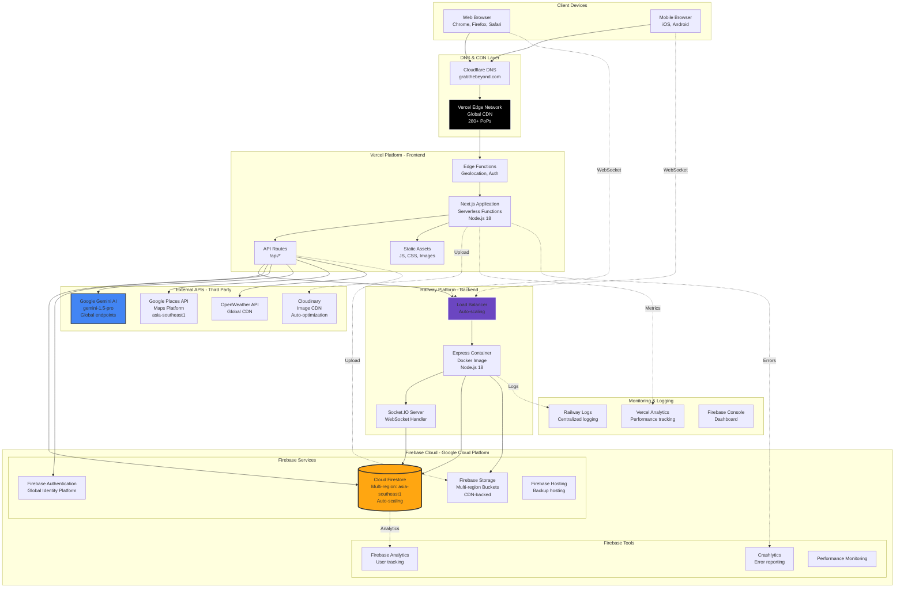
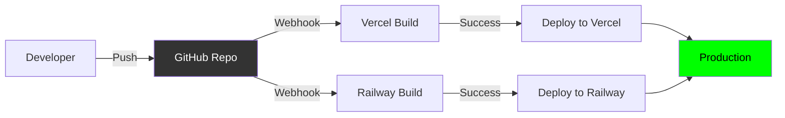
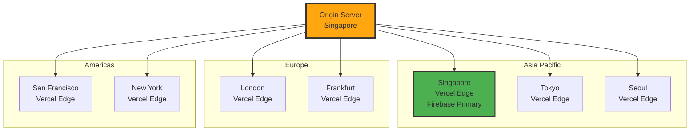

# Deployment Diagram

## 🚀 Infrastructure & Deployment Architecture

Sơ đồ triển khai mô tả cách hệ thống GrabTheBeyond được deploy lên production environment.

---

## 🌐 Production Deployment Architecture



---

## 🏗️ Infrastructure Details

### 1. **Frontend Hosting - Vercel**

**Platform**: Vercel (Optimized for Next.js)

**Configuration:**
```json
{
  "buildCommand": "npm run build",
  "outputDirectory": ".next",
  "framework": "nextjs",
  "regions": ["sin1", "hnd1", "icn1"],
  "functions": {
    "maxDuration": 30
  },
  "env": {
    "NEXT_PUBLIC_FIREBASE_API_KEY": "@firebase-api-key",
    "NEXT_PUBLIC_GEMINI_API_KEY": "@gemini-api-key",
    "NODE_ENV": "production"
  }
}
```

**Features:**
- ✅ **Edge Functions**: Executed at edge locations (Singapore, Tokyo, Seoul)
- ✅ **Serverless Functions**: API Routes auto-deployed as AWS Lambda
- ✅ **Automatic HTTPS**: SSL certificates via Let's Encrypt
- ✅ **Global CDN**: 280+ Points of Presence worldwide
- ✅ **DDoS Protection**: Built-in security
- ✅ **Analytics**: Core Web Vitals tracking

**Scaling:**
- **Automatic**: Scales to zero when idle, scales up on demand
- **Concurrent requests**: Unlimited (per plan)
- **Response time**: <100ms (p95)

---

### 2. **Backend Hosting - Railway**

**Platform**: Railway (Container-based deployment)

**Dockerfile:**
```dockerfile
FROM node:18-alpine

WORKDIR /app

COPY package*.json ./
RUN npm ci --only=production

COPY server/ ./server/
COPY lib/ ./lib/

EXPOSE 3001

CMD ["node", "server/index.js"]
```

**railway.json:**
```json
{
  "build": {
    "builder": "DOCKERFILE"
  },
  "deploy": {
    "startCommand": "node server/index.js",
    "healthcheckPath": "/health",
    "restartPolicyType": "ON_FAILURE"
  }
}
```

**Features:**
- ✅ **Docker Containers**: Isolated execution environment
- ✅ **Auto-scaling**: Vertical scaling (CPU/Memory)
- ✅ **Health Checks**: Auto-restart on failure
- ✅ **Logs**: Centralized logging with search
- ✅ **Environment Variables**: Encrypted secrets

**Scaling:**
- **Manual Vertical Scaling**: Up to 32GB RAM, 8 vCPUs
- **Connection Pooling**: Socket.IO with sticky sessions
- **Load Balancer**: Built-in L7 load balancer

---

### 3. **Database - Firebase Firestore**

**Platform**: Google Cloud Platform (managed)

**Configuration:**
- **Region**: `asia-southeast1` (Singapore)
- **Database Mode**: Native Mode
- **Indexes**: Composite indexes for complex queries
- **Backup**: Automated daily backups (Blaze plan)

**Firestore Quotas:**
| Metric | Free Tier | Blaze Plan |
|--------|-----------|------------|
| Document reads | 50K/day | Unlimited |
| Document writes | 20K/day | Unlimited |
| Storage | 1 GB | Unlimited |
| Bandwidth | 10 GB/month | Pay-as-you-go |

**Performance:**
- **Read Latency**: <50ms (p95)
- **Write Latency**: <100ms (p95)
- **Concurrent Connections**: 1M+
- **Real-time Listeners**: 100K+ per database

---

### 4. **Authentication - Firebase Auth**

**Configuration:**
- **Providers**: Email/Password, Google OAuth, Facebook OAuth
- **Session Duration**: 1 hour (default), refresh tokens for 30 days
- **Security**: Multi-factor authentication (MFA) ready

**Quotas:**
- **Monthly Active Users (MAU)**: Unlimited (free up to 50K)
- **Sign-in Rate**: 10K/minute

---

### 5. **File Storage - Firebase Storage + Cloudinary**

#### Firebase Storage:
```
gs://grabthebeyond.appspot.com/
├── incident_images/
│   ├── {userId}/
│   │   ├── {incidentId}_original.jpg
│   │   └── {incidentId}_thumb.jpg
```

**Configuration:**
- **Region**: `asia-southeast1`
- **CDN**: Enabled (Google CDN)
- **Access**: Signed URLs (24-hour expiry)
- **Storage Limit**: 5GB (Blaze plan)

#### Cloudinary (Alternative):
```
https://res.cloudinary.com/grabthebeyond/
├── image/upload/
│   ├── c_fill,w_800,h_600/incidents/{publicId}.jpg
│   └── c_thumb,w_200,h_200/incidents/{publicId}.jpg
```

**Features:**
- ✅ **Auto-optimization**: WebP, AVIF formats
- ✅ **Transformations**: Resize, crop, filters on-the-fly
- ✅ **CDN**: Global delivery via AWS CloudFront

---

### 6. **External APIs**

#### Google Gemini AI:
- **Endpoint**: `generativelanguage.googleapis.com`
- **Model**: `gemini-1.5-pro`
- **Rate Limit**: 60 requests/minute (free tier)
- **Quota**: 50K requests/month

#### Google Places API:
- **Endpoint**: `maps.googleapis.com/maps/api/place`
- **Services**: Text Search, Place Details, Place Photos
- **Rate Limit**: 1000 requests/day (free tier)
- **Cost**: $17/1000 requests (paid tier)

#### OpenWeather API:
- **Endpoint**: `api.openweathermap.org/data/2.5`
- **Plan**: Free (1000 calls/day)
- **Latency**: <200ms

---

## 🔐 Security Configuration

### SSL/TLS Certificates:
- **Vercel**: Automatic Let's Encrypt SSL (wildcard)
- **Railway**: Automatic SSL for custom domains
- **Firebase**: HTTPS-only by default

### Environment Variables (Secrets):
```bash
# Vercel Environment Variables
NEXT_PUBLIC_FIREBASE_API_KEY=***
NEXT_PUBLIC_FIREBASE_PROJECT_ID=***
NEXT_PUBLIC_GEMINI_API_KEY=***
NEXT_PUBLIC_GOOGLE_PLACES_API_KEY=***
OPENWEATHER_API_KEY=***

# Railway Environment Variables
PORT=3001
FIREBASE_ADMIN_PROJECT_ID=***
FIREBASE_ADMIN_CLIENT_EMAIL=***
FIREBASE_ADMIN_PRIVATE_KEY=***
```

### CORS Configuration:
```typescript
// next.config.js
module.exports = {
  async headers() {
    return [
      {
        source: '/api/:path*',
        headers: [
          { key: 'Access-Control-Allow-Origin', value: 'https://grabthebeyond.com' },
          { key: 'Access-Control-Allow-Methods', value: 'GET,POST,PUT,DELETE,OPTIONS' },
          { key: 'Access-Control-Allow-Headers', value: 'Content-Type, Authorization' },
        ],
      },
    ];
  },
};
```

---

## 📊 Monitoring & Observability

### 1. **Vercel Analytics**
- **Metrics**: Core Web Vitals (LCP, FID, CLS)
- **Real User Monitoring**: Page load times, geographic distribution
- **Alerts**: Performance degradation alerts

### 2. **Railway Logs**
```bash
# View logs
railway logs --follow

# Search logs
railway logs | grep ERROR

# Export logs
railway logs --json > logs.json
```

### 3. **Firebase Console**
- **Firestore Usage**: Reads, writes, storage metrics
- **Auth Analytics**: Sign-ins, active users
- **Performance Monitoring**: API response times

### 4. **Error Tracking** (Optional - Sentry)
```typescript
import * as Sentry from '@sentry/nextjs';

Sentry.init({
  dsn: process.env.NEXT_PUBLIC_SENTRY_DSN,
  environment: 'production',
  tracesSampleRate: 0.1,
});
```

---

## 🚦 CI/CD Pipeline

### Git Workflow:


### Vercel Deployment:
```yaml
# vercel.json
{
  "git": {
    "deploymentEnabled": {
      "main": true
    }
  },
  "github": {
    "enabled": true,
    "autoAlias": true
  }
}
```

**Deployment Steps:**
1. Push to `main` branch
2. Vercel detects commit via GitHub webhook
3. Builds Next.js app (`npm run build`)
4. Runs tests (if configured)
5. Deploys to production URL
6. Invalidates CDN cache
7. Sends deployment notification

**Build Time**: ~2-3 minutes

---

### Railway Deployment:
```yaml
# railway.toml
[build]
builder = "DOCKERFILE"
watchPatterns = ["server/**", "lib/**"]

[deploy]
startCommand = "node server/index.js"
healthcheckPath = "/health"
healthcheckTimeout = 100
restartPolicyType = "ON_FAILURE"
restartPolicyMaxRetries = 10
```

**Deployment Steps:**
1. Push to `main` branch
2. Railway detects commit
3. Builds Docker image
4. Runs health checks
5. Blue-green deployment (zero downtime)
6. Routes traffic to new container

**Build Time**: ~3-5 minutes

---

## 💰 Cost Estimation (Monthly)

| Service | Plan | Cost (USD) |
|---------|------|-----------|
| **Vercel** | Hobby | $0 (free) |
| **Railway** | Hobby | $5/month |
| **Firebase** | Blaze | $25-50/month |
| **Google Gemini AI** | Free tier | $0 (under 50K req) |
| **Google Places API** | Pay-as-you-go | $10-20/month |
| **OpenWeather** | Free | $0 |
| **Cloudinary** | Free | $0 (under 25GB) |
| **Domain** | Cloudflare | $10/year |
| **Total** | | **$40-75/month** |

**Scaling Costs:**
- **10K users**: ~$100/month
- **100K users**: ~$500/month
- **1M users**: ~$3,000/month

---

## 🌍 Geographic Distribution



**Primary Region**: Singapore (asia-southeast1)  
**Edge Locations**: 7+ (optimized for APAC users)

---

## 🔄 Disaster Recovery

### Backup Strategy:
1. **Firestore**: Automated daily backups (retained for 30 days)
2. **Firebase Storage**: Versioning enabled
3. **Code**: GitHub repository (multiple contributors)
4. **Configuration**: Environment variables backed up in 1Password/Vault

### Recovery Time Objective (RTO):
- **Vercel**: <5 minutes (rollback to previous deployment)
- **Railway**: <10 minutes (redeploy from GitHub)
- **Firestore**: <1 hour (restore from backup)

### Recovery Point Objective (RPO):
- **Database**: <24 hours (daily backups)
- **Code**: <1 minute (git history)

---

**Deployment Architecture Version**: 1.0  
**Last Updated**: December 2025  
**Production URL**: https://grabthebeyond.vercel.app

