# Data Flow Diagram (DFD)

## 🔄 System Data Flow Analysis

Data Flow Diagram mô tả cách dữ liệu di chuyển qua các thành phần của hệ thống GrabTheBeyond.

---

## 📊 Level 0 - Context Diagram

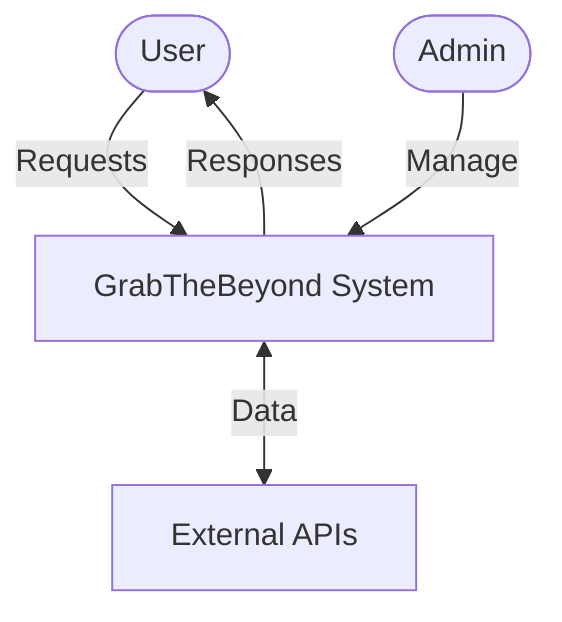

---

## 📈 Level 1 - Main Processes

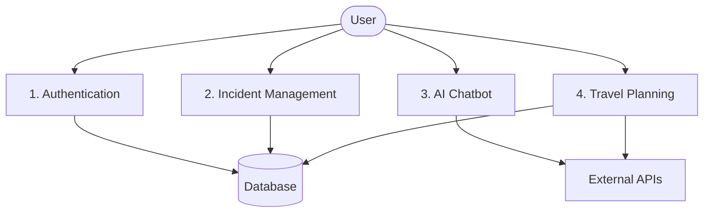

---

## 🔍 Level 2 - Detailed Processes

### 2.1 Incident Reporting Process

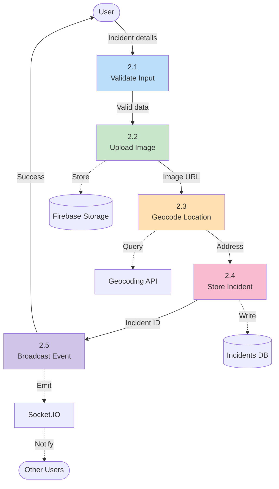

---

### 2.2 AI Chatbot Processing

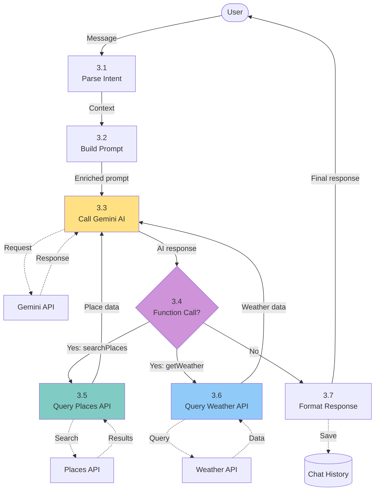

---

### 2.3 Travel Plan Generation

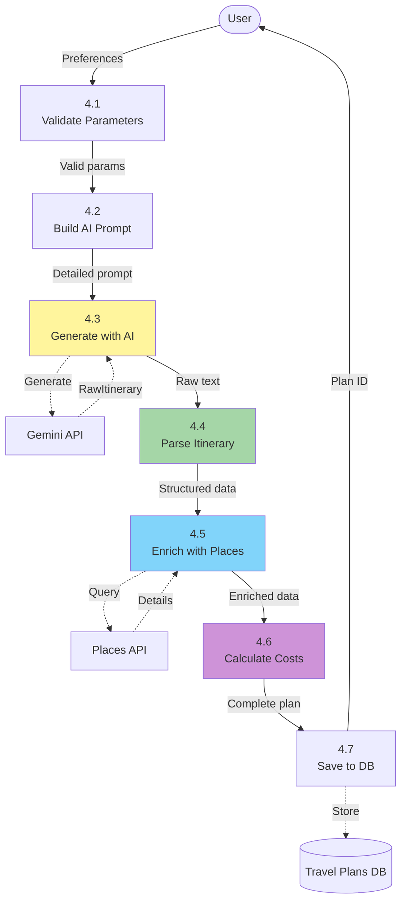

---

## 🔥 Real-time Data Synchronization Flow

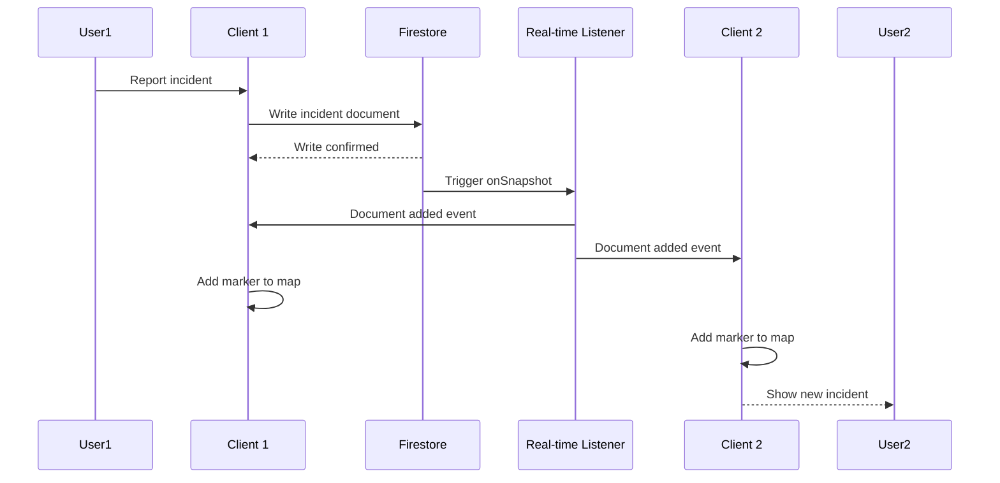

---

## 📤 Data Flow Matrices

### Input/Output Matrix

| Process | Input Data | Output Data | Data Store |
|---------|-----------|-------------|------------|
| **1.0 Authentication** | Email, password | User profile, JWT token | Users DB |
| **2.0 Incident Reporting** | Title, description, location, image | Incident ID, confirmation | Incidents DB, Storage |
| **3.0 AI Chatbot** | User message, context | AI response, places | Chat History DB |
| **4.0 Travel Planning** | Days, budget, interests | Travel plan, itinerary | Travel Plans DB |
| **5.0 Real-time Sync** | Database changes | Real-time events | Online Users Cache |

---

### Data Store Access Matrix

| Process | Users (D1) | Incidents (D2) | Travel Plans (D3) | Chat (D4) | Online (D5) |
|---------|:----------:|:--------------:|:-----------------:|:---------:|:-----------:|
| **1.0 Authentication** | R/W | - | - | - | W |
| **2.0 Incident Reporting** | R | R/W | - | - | - |
| **3.0 AI Chatbot** | R | R | R | R/W | - |
| **4.0 Travel Planning** | R | - | R/W | - | - |
| **5.0 Real-time Sync** | - | R | R | - | R |

**Legend**: R = Read, W = Write

---

## 🌊 Critical Data Flows

### Flow 1: Incident Creation with Image

```mermaid
graph LR
    A[User Input] --> B[Validate]
    B --> C[Compress Image]
    C --> D[Upload to Cloudinary]
    D --> E[Get Image URL]
    E --> F[Reverse Geocode]
    F --> G[Create Firestore Doc]
    G --> H[Emit Socket Event]
    H --> I[Broadcast to Clients]
    I --> J[Update UI]

    style A fill:#E3F2FD
    style D fill:#FFE0B2
    style G fill:#C8E6C9
    style H fill:#F8BBD0
```

**Data Elements:**
- `title`: string (max 100 chars)
- `description`: string (max 500 chars)
- `category`: enum (8 options)
- `severity`: enum (4 levels)
- `location`: { lat: number, lng: number }
- `imageFile`: File (max 5MB, JPEG/PNG)
- `imageUrl`: string (Cloudinary URL)
- `address`: string (reverse geocoded)

---

### Flow 2: AI Function Calling

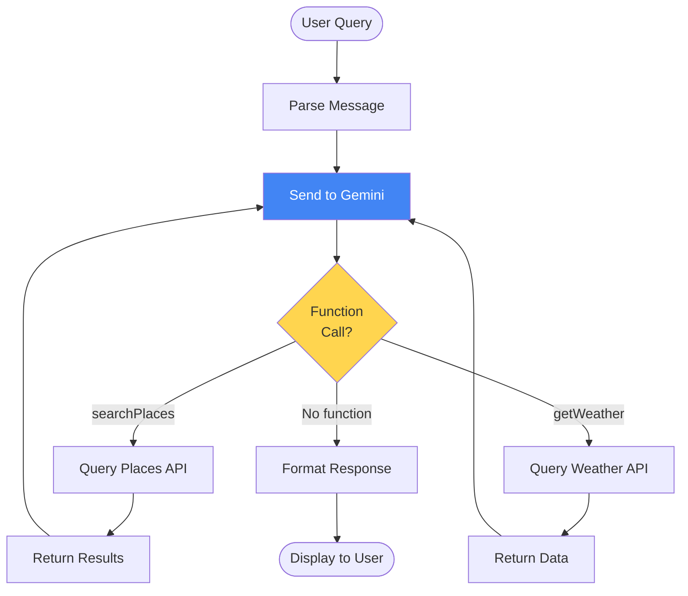

**Function Call Schema:**
```json
{
  "name": "searchPlaces",
  "parameters": {
    "query": "string",
    "location": { "lat": "number", "lng": "number" },
    "radius": "number",
    "type": "string"
  }
}
```

---

### Flow 3: Online Users Tracking

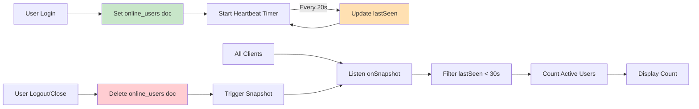

---

## 📊 Data Volume Estimates

### Expected Data Volumes (1 year)

| Data Type | Records | Storage | Growth Rate |
|-----------|---------|---------|-------------|
| **Users** | 10,000 | 50 MB | 1K/month |
| **Incidents** | 50,000 | 200 MB | 5K/month |
| **Travel Plans** | 20,000 | 500 MB | 2K/month |
| **Chat Messages** | 100,000 | 300 MB | 10K/month |
| **Incident Images** | 30,000 | 15 GB | 3K/month |

**Total Storage (Year 1)**: ~16 GB

---

## 🔒 Data Security Flow

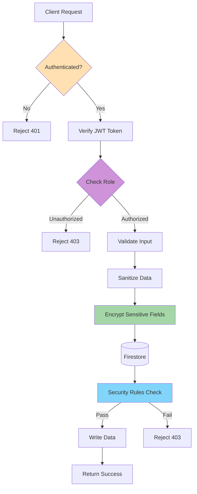

---

## 🔄 Data Transformation Pipeline

### Travel Plan Generation Pipeline

```mermaid
graph LR
    INPUT[User Input<br/>Preferences] --> VALIDATE[Validate<br/>& Sanitize]
    VALIDATE --> PROMPT[Build<br/>AI Prompt]
    PROMPT --> AI[Gemini AI<br/>Generation]
    AI --> PARSE[Parse<br/>Markdown]
    PARSE --> STRUCTURE[Structure<br/>JSON]
    STRUCTURE --> ENRICH[Enrich<br/>with Places API]
    ENRICH --> CALC[Calculate<br/>Costs]
    CALC --> FORMAT[Format<br/>for Display]
    FORMAT --> SAVE[Save to<br/>Firestore]
    SAVE --> OUTPUT[Output<br/>Travel Plan]

    style INPUT fill:#E3F2FD
    style AI fill:#4285f4,color:#fff
    style ENRICH fill:#FFE0B2
    style SAVE fill:#C8E6C9
```

**Transformation Steps:**

1. **Input** (User Form):
```json
{
  "days": 3,
  "budget": 5000000,
  "people": 2,
  "interests": ["beach", "food"]
}
```

2. **AI Prompt** (Engineered):
```text
Create a 3-day travel itinerary for Da Nang, Vietnam.
Budget: 5,000,000 VND for 2 people.
Interests: beach activities, local food.
Format: Day 1: Morning/Afternoon/Evening activities...
```

3. **AI Output** (Raw Text):
```text
Day 1:
Morning: Visit My Khe Beach...
Afternoon: Lunch at seafood restaurant...
```

4. **Parsed Structure** (JSON):
```json
{
  "days": [
    {
      "day": 1,
      "activities": [
        {
          "timeSlot": "morning",
          "name": "My Khe Beach",
          "description": "..."
        }
      ]
    }
  ]
}
```

5. **Enriched Data** (With Places API):
```json
{
  "days": [
    {
      "day": 1,
      "activities": [
        {
          "name": "My Khe Beach",
          "placeId": "ChIJ...",
          "rating": 4.5,
          "photos": ["https://..."],
          "location": { "lat": 16.04, "lng": 108.24 }
        }
      ]
    }
  ]
}
```

6. **Final Output** (With Costs):
```json
{
  "planId": "plan_123",
  "totalCost": 4800000,
  "dailyCosts": [1600000, 1800000, 1400000],
  "days": [...]
}
```

---

## 📈 Data Flow Performance Metrics

| Flow | Avg Latency | Data Size | Calls/Day |
|------|-------------|-----------|-----------|
| **User Login** | <200ms | 2 KB | 1,000 |
| **Incident Report** | <500ms | 50 KB (with image) | 500 |
| **AI Chat** | <2,000ms | 5 KB | 2,000 |
| **Travel Plan Gen** | <5,000ms | 50 KB | 200 |
| **Real-time Sync** | <100ms | 1 KB | 10,000 |

---

**Data Flow Diagram Version**: 1.0  
**Last Updated**: December 2025  
**Notation**: Yourdon-DeMarco DFD

