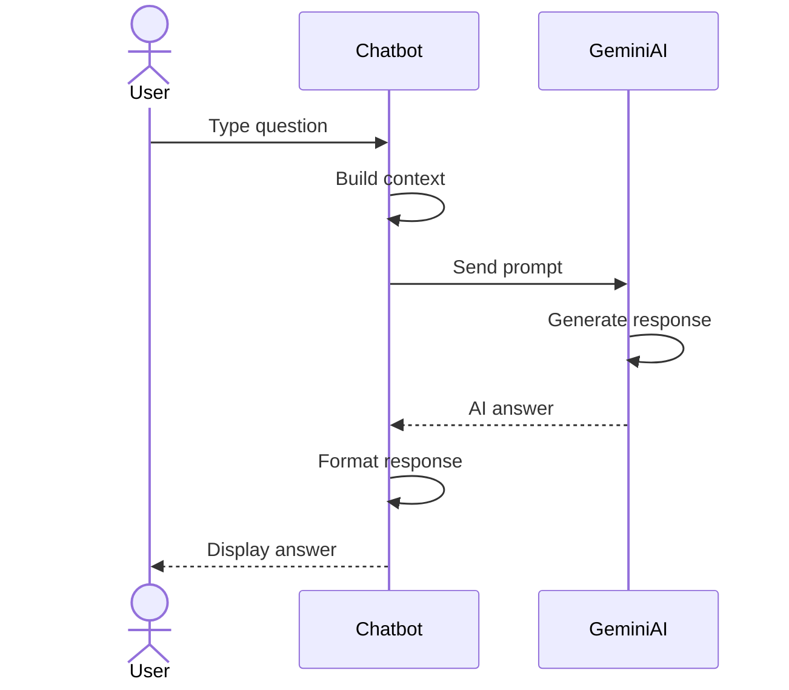
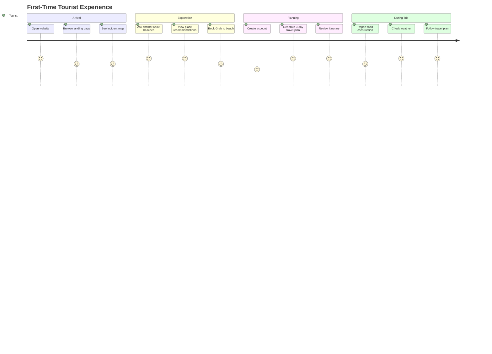
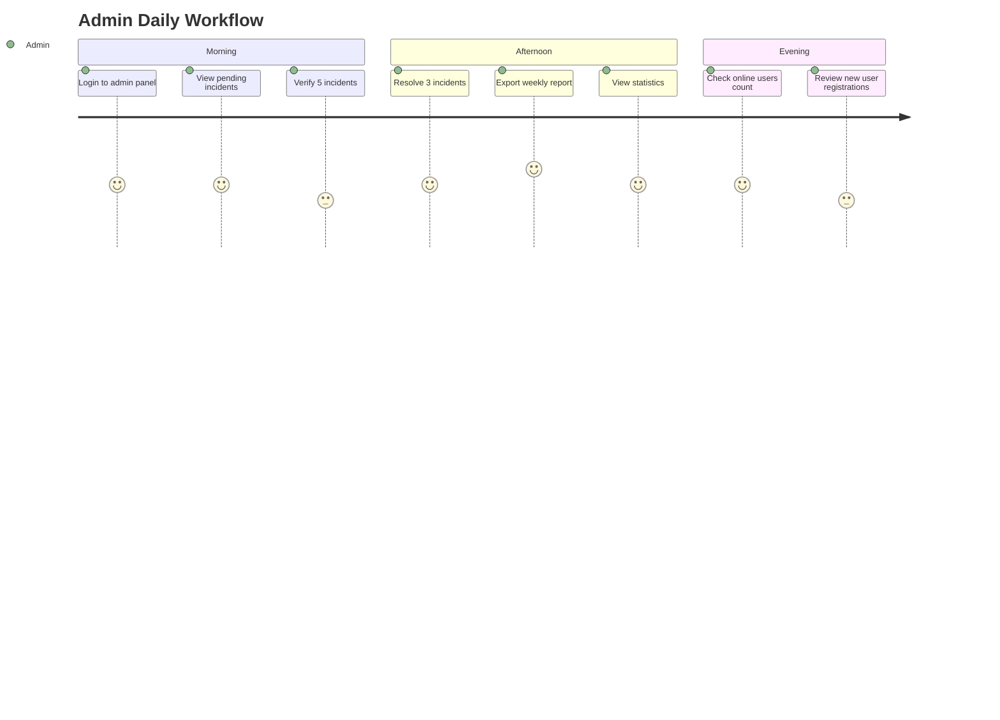

# Use Case Diagram

## 👥 System Use Cases & Actors

Use Case Diagram mô tả các tương tác giữa users và hệ thống GrabTheBeyond.

---

## 🎭 Actors

| Actor | Description | Responsibilities |
|-------|-------------|-----------------|
| **Tourist/User** | Regular tourist visiting Da Nang | Report incidents, use chatbot, plan trips |
| **Admin** | System administrator | Manage incidents, view statistics, export reports |
| **Gemini AI System** | Google's AI service | Provide chatbot responses, generate travel plans |
| **Places API** | Google Places service | Provide venue information and photos |
| **Weather Service** | OpenWeather API | Provide real-time weather data |
| **Grab System** | Grab ride-hailing app | Handle ride bookings via deep links |

---

## 📊 Main Use Case Diagram

```mermaid
graph TB
    subgraph "GrabTheBeyond System"
        subgraph "Incident Management"
            UC1[Report Incident]
            UC2[View Incident Map]
            UC3[Filter Incidents]
            UC4[Verify Incident]
            UC5[Resolve Incident]
            UC6[Export Incident Report]
        end

        subgraph "AI Chatbot"
            UC7[Ask Travel Questions]
            UC8[Search Places]
            UC9[Get Weather Info]
            UC10[Get Recommendations]
            UC11[Voice Input]
        end

        subgraph "Travel Planning"
            UC12[Create Travel Plan]
            UC13[View Travel Plans]
            UC14[Edit Travel Plan]
            UC15[Share Travel Plan]
        end

        subgraph "User Management"
            UC16[Register Account]
            UC17[Login/Logout]
            UC18[Update Profile]
            UC19[View Profile]
        end

        subgraph "Grab Integration"
            UC20[Book Grab Ride]
            UC21[Get Fare Estimate]
        end

        subgraph "Real-time Features"
            UC22[Track Online Users]
            UC23[Receive Real-time Alerts]
        end
    end

    %% Actors
    USER([Tourist/User])
    ADMIN([Admin])
    GEMINI[Gemini AI]
    PLACES[Places API]
    WEATHER[Weather Service]
    GRAB[Grab System]

    %% User connections
    USER --> UC1
    USER --> UC2
    USER --> UC3
    USER --> UC7
    USER --> UC8
    USER --> UC9
    USER --> UC10
    USER --> UC11
    USER --> UC12
    USER --> UC13
    USER --> UC14
    USER --> UC15
    USER --> UC16
    USER --> UC17
    USER --> UC18
    USER --> UC19
    USER --> UC20
    USER --> UC21
    USER --> UC22
    USER --> UC23

    %% Admin connections
    ADMIN --> UC2
    ADMIN --> UC3
    ADMIN --> UC4
    ADMIN --> UC5
    ADMIN --> UC6
    ADMIN --> UC18
    ADMIN --> UC19

    %% External system connections
    UC7 --> GEMINI
    UC8 --> PLACES
    UC9 --> WEATHER
    UC10 --> GEMINI
    UC12 --> GEMINI
    UC12 --> PLACES
    UC20 --> GRAB
    UC21 --> GRAB

    %% Include relationships
    UC1 -.include.-> UC2
    UC4 -.include.-> UC2
    UC7 -.include.-> UC8
    UC10 -.include.-> UC8
    UC12 -.include.-> UC8

    style USER fill:#2196F3,stroke:#333,stroke-width:2px,color:#fff
    style ADMIN fill:#FF9800,stroke:#333,stroke-width:2px,color:#fff
    style GEMINI fill:#4285f4,stroke:#333,stroke-width:2px,color:#fff
```

---

## 📋 Detailed Use Cases

### 1. Incident Management Use Cases

#### UC1: Report Incident

**Primary Actor**: Tourist/User

**Preconditions**:
- User must be logged in
- User must grant location permission

**Main Flow**:
1. User clicks "Report Incident" button
2. System opens report form with map
3. User clicks on map to select location
4. User fills in title, description, category, severity
5. User uploads photo (optional)
6. User submits form
7. System validates input
8. System uploads image to Cloudinary
9. System reverse geocodes coordinates
10. System saves incident to Firestore
11. System broadcasts event via Socket.IO
12. System confirms success to user
13. System updates map with new incident marker

**Postconditions**:
- New incident is stored in database
- All online users see the incident on map
- Admin can see incident in dashboard

**Alternative Flows**:
- 3a. User uses current GPS location instead of clicking map
- 7a. Validation fails → Show error messages
- 8a. Image upload fails → Save incident without image

**Exception Flows**:
- Network error → Show retry option
- Location permission denied → Show manual input

---

#### UC4: Verify Incident (Admin Only)

**Primary Actor**: Admin

**Preconditions**:
- Admin must be logged in
- Incident status is "pending"

**Main Flow**:
1. Admin views incident list in admin dashboard
2. Admin clicks on incident to view details
3. Admin reviews incident information and photo
4. Admin clicks "Verify" button
5. System updates incident status to "verified"
6. System broadcasts update via real-time listener
7. System updates marker color on all users' maps

**Postconditions**:
- Incident status changed to "verified"
- All users see updated status

---

### 2. AI Chatbot Use Cases

#### UC7: Ask Travel Questions

**Primary Actor**: Tourist/User

**Preconditions**:
- None (public access)

**Main Flow**:
1. User opens chatbot interface
2. User types question (e.g., "What are the best beaches in Da Nang?")
3. System builds context with user location
4. System sends prompt to Gemini AI
5. AI processes request
6. AI generates response
7. System formats response
8. System displays response to user

**Extensions**:
- **UC8 (Include)**: If AI suggests places, trigger place search
- **UC11 (Extend)**: User can use voice input instead of typing

**Alternative Flows**:
- 5a. AI requests function call (searchPlaces) → Execute UC8
- 5b. AI requests weather data → Execute UC9
- 7a. Response includes place recommendations → Display PlaceCards

---

#### UC8: Search Places

**Primary Actor**: Tourist/User (or AI System)

**Main Flow**:
1. User/AI initiates place search with query
2. System calls Google Places API
3. API returns list of places
4. System enriches with ratings, photos, reviews
5. System displays PlaceCards
6. User can click "Get Directions" or "Book Grab"

**Postconditions**:
- Places displayed in chat
- User can interact with place cards

---

### 3. Travel Planning Use Cases

#### UC12: Create Travel Plan

**Primary Actor**: Tourist/User

**Preconditions**:
- User must be logged in

**Main Flow**:
1. User navigates to Travel Planner page
2. User fills form:
   - Number of days (1-7)
   - Budget (VND)
   - Number of people
   - Interests (beach, food, culture, etc.)
3. User submits form
4. System validates input
5. System builds AI prompt
6. System calls Gemini AI for itinerary generation
7. AI generates day-by-day itinerary
8. System parses AI response
9. System enriches activities with Google Places data
10. System calculates estimated costs
11. System saves travel plan to Firestore
12. System redirects to travel plan view page
13. User views detailed itinerary with map

**Postconditions**:
- Travel plan saved to database
- User can view/edit/share plan

**Exception Flows**:
- 4a. Invalid input → Show validation errors
- 6a. AI API error → Show error message with retry option
- 10a. Cost exceeds budget → Show warning, suggest adjustments

---

### 4. User Management Use Cases

#### UC16: Register Account

**Primary Actor**: Tourist/User

**Preconditions**:
- User must not be logged in

**Main Flow**:
1. User clicks "Sign Up" button
2. System shows registration form
3. User enters email, password, full name
4. System validates input (password strength, email format)
5. System creates Firebase Auth account
6. System creates user profile in Firestore
7. System marks user as online
8. System redirects to onboarding tutorial
9. User completes welcome tour

**Postconditions**:
- User account created
- User is logged in
- User is marked as online

---

#### UC17: Login/Logout

**Primary Actor**: Tourist/User

**Login Flow**:
1. User enters email and password
2. System authenticates via Firebase Auth
3. System retrieves user profile from Firestore
4. System marks user as online (online_users collection)
5. System starts heartbeat (20s interval)
6. System redirects to dashboard

**Logout Flow**:
1. User clicks "Logout" button
2. System marks user as offline
3. System stops heartbeat
4. System signs out from Firebase Auth
5. System redirects to landing page

---

### 5. Grab Integration Use Cases

#### UC20: Book Grab Ride

**Primary Actor**: Tourist/User

**Preconditions**:
- User has Grab app installed
- User has viewed place recommendation from chatbot

**Main Flow**:
1. User views PlaceCard with destination
2. User clicks "Book Grab" button
3. System gets user's current location
4. System formats Grab deep link with pickup & dropoff coordinates
5. System opens deep link
6. Mobile OS launches Grab app
7. Grab app pre-fills booking form
8. User confirms booking in Grab app

**Alternative Flows**:
- 6a. Grab app not installed → Redirect to app store

---

### 6. Real-time Features Use Cases

#### UC22: Track Online Users

**Primary Actor**: System (Automatic)

**Triggers**:
- User logs in/out
- User closes browser tab
- Heartbeat timeout

**Main Flow**:
1. User logs in
2. System writes to online_users collection
3. System starts heartbeat timer (20s interval)
4. Every 20s, system updates lastSeen timestamp
5. Real-time listener on all clients monitors online_users
6. System counts users with lastSeen < 30s ago
7. System updates "X users online" counter on UI

**Cleanup Flow**:
- User closes tab → sendBeacon to /api/users/offline
- System deletes user from online_users
- Counter decrements on all clients

---

#### UC23: Receive Real-time Alerts

**Primary Actor**: Tourist/User

**Preconditions**:
- User is viewing incident map

**Main Flow**:
1. User is viewing map with existing incidents
2. Another user reports new incident
3. Firestore triggers onSnapshot event
4. User's client receives document change
5. System adds new marker to map
6. System shows notification toast
7. User can click marker to view details

**Benefits**:
- Users stay informed about nearby incidents
- No page refresh needed

---

## 🔄 Use Case Relationships

### Include Relationships:
- **UC1 (Report Incident)** includes **UC2 (View Map)**: Must view map to select location
- **UC7 (Ask Question)** includes **UC8 (Search Places)**: AI may need to search places
- **UC12 (Create Plan)** includes **UC8 (Search Places)**: Must search places to enrich itinerary

### Extend Relationships:
- **UC11 (Voice Input)** extends **UC7 (Ask Question)**: Alternative input method
- **UC15 (Share Plan)** extends **UC13 (View Plan)**: Additional feature
- **UC21 (Fare Estimate)** extends **UC20 (Book Grab)**: Optional before booking

### Generalization:
- **UC4 (Verify Incident)** and **UC5 (Resolve Incident)** generalize to **Manage Incident**
- **UC16 (Register)** and **UC17 (Login)** generalize to **Authentication**

---

## 📊 Use Case Priority Matrix

| Use Case | Priority | Frequency | Complexity |
|----------|----------|-----------|------------|
| UC17: Login/Logout | Critical | High | Low |
| UC2: View Incident Map | Critical | High | Medium |
| UC7: Ask Travel Questions | High | High | High |
| UC1: Report Incident | High | Medium | High |
| UC12: Create Travel Plan | High | Medium | Very High |
| UC8: Search Places | High | High | Medium |
| UC20: Book Grab Ride | Medium | Medium | Low |
| UC4: Verify Incident | Medium | Low | Low |
| UC22: Track Online Users | Low | Automatic | Medium |

---

## 🎯 User Journey Map

### Journey 1: First-Time Tourist

---

### Journey 2: Admin Daily Tasks

---

## 📈 Use Case Statistics (Projected)

| Use Case | Users/Day | Avg Duration | Success Rate |
|----------|-----------|--------------|--------------|
| View Incident Map | 500 | 3 min | 100% |
| Ask Travel Questions | 300 | 5 min | 95% |
| Create Travel Plan | 50 | 8 min | 90% |
| Report Incident | 30 | 2 min | 98% |
| Book Grab Ride | 100 | 1 min | 85% |
| Login/Logout | 200 | 30 sec | 99% |
| Register Account | 20 | 2 min | 95% |

---

## 🔐 Access Control Matrix

| Use Case | Guest | User | Admin |
|----------|:-----:|:----:|:-----:|
| UC2: View Map | ✅ | ✅ | ✅ |
| UC7: Ask Questions | ✅ | ✅ | ✅ |
| UC1: Report Incident | ❌ | ✅ | ✅ |
| UC12: Create Travel Plan | ❌ | ✅ | ✅ |
| UC4: Verify Incident | ❌ | ❌ | ✅ |
| UC5: Resolve Incident | ❌ | ❌ | ✅ |
| UC6: Export Reports | ❌ | ❌ | ✅ |
| UC20: Book Grab | ✅ | ✅ | ✅ |

---

**Use Case Diagram Version**: 1.0  
**Last Updated**: December 2025  
**UML Version**: 2.5

