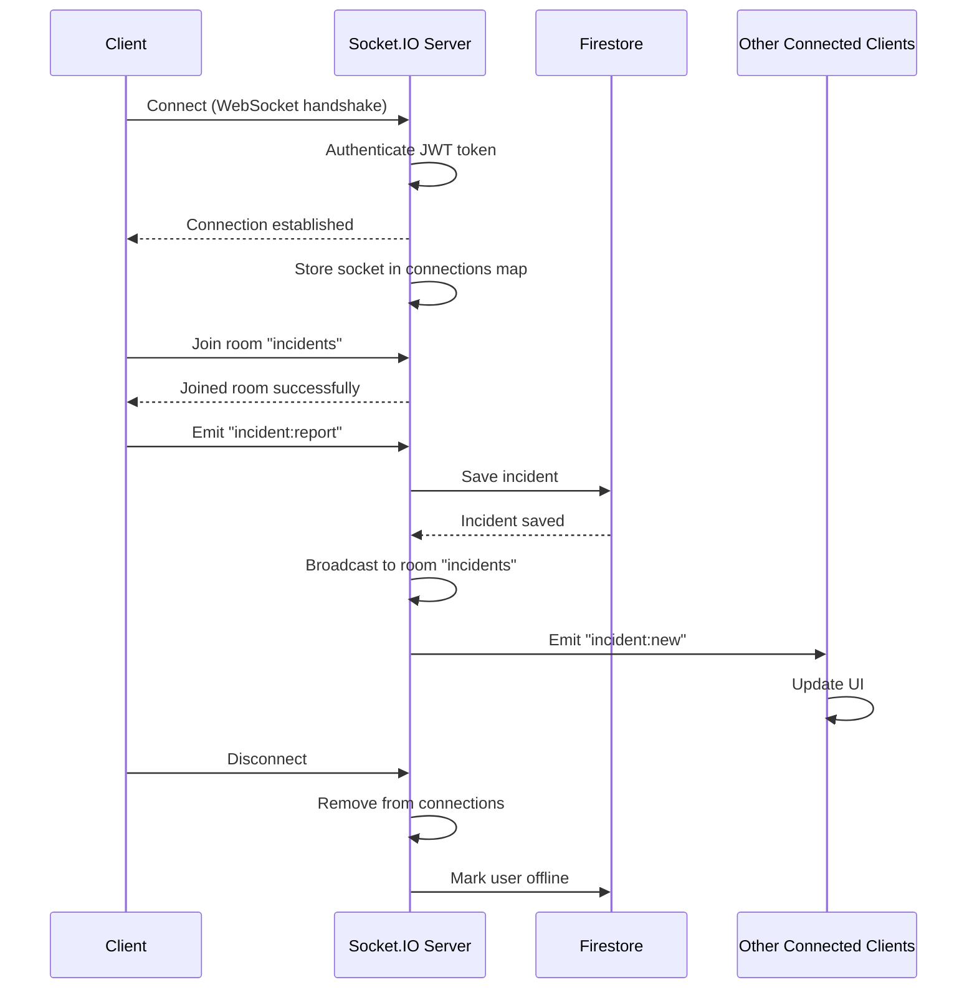
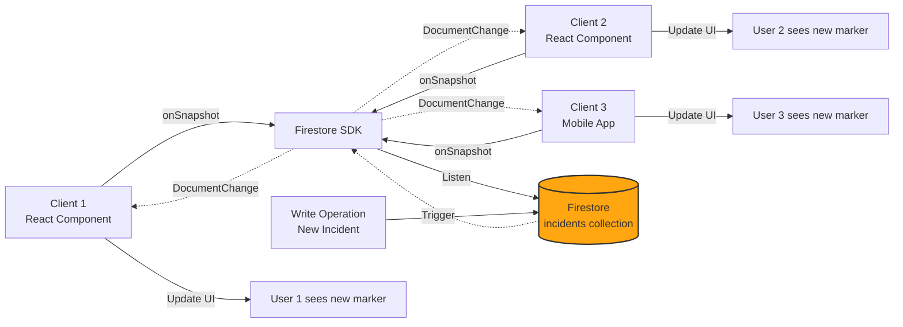
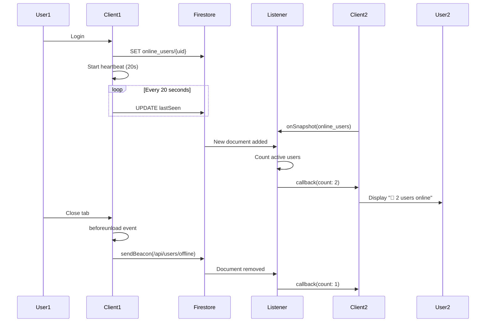
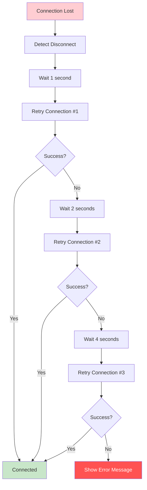

# Real-time Communication Architecture

## ⚡ WebSocket & Real-time Synchronization

Tài liệu chi tiết về kiến trúc real-time communication sử dụng Socket.IO và Firestore Real-time Listeners.

---

## 🌐 Real-time Architecture Overview

```mermaid
graph TB
    subgraph "Client Layer"
        USER1[User 1 Browser]
        USER2[User 2 Browser]
        USER3[User 3 Mobile]
        ADMIN[Admin Dashboard]
    end

    subgraph "Real-time Communication Layer"
        subgraph "Socket.IO Infrastructure"
            SOCKET_SERVER[Socket.IO Server<br/>WebSocket Handler]
            ROOMS[Socket Rooms<br/>incidents, users]
            EVENT_BUS[Event Bus<br/>Broadcast Manager]
        end

        subgraph "Firestore Real-time"
            FIRESTORE_LISTENER[Firestore Listeners<br/>onSnapshot()]
            FIRESTORE_DB[(Firestore<br/>Real-time DB)]
        end
    end

    subgraph "Event Sources"
        INCIDENT_CREATE[Incident Created]
        INCIDENT_UPDATE[Incident Updated]
        USER_ONLINE[User Online/Offline]
        CHAT_MESSAGE[Chat Message]
    end

    USER1 -.WebSocket.-> SOCKET_SERVER
    USER2 -.WebSocket.-> SOCKET_SERVER
    USER3 -.WebSocket.-> SOCKET_SERVER
    ADMIN -.WebSocket.-> SOCKET_SERVER

    SOCKET_SERVER --> ROOMS
    ROOMS --> EVENT_BUS

    USER1 --> FIRESTORE_LISTENER
    USER2 --> FIRESTORE_LISTENER
    USER3 --> FIRESTORE_LISTENER
    ADMIN --> FIRESTORE_LISTENER

    FIRESTORE_LISTENER --> FIRESTORE_DB

    INCIDENT_CREATE --> SOCKET_SERVER
    INCIDENT_UPDATE --> FIRESTORE_DB
    USER_ONLINE --> FIRESTORE_DB
    CHAT_MESSAGE --> SOCKET_SERVER

    EVENT_BUS -.Broadcast.-> USER1
    EVENT_BUS -.Broadcast.-> USER2
    EVENT_BUS -.Broadcast.-> USER3
    EVENT_BUS -.Broadcast.-> ADMIN

    FIRESTORE_DB -.onSnapshot.-> FIRESTORE_LISTENER
    FIRESTORE_LISTENER -.Updates.-> USER1
    FIRESTORE_LISTENER -.Updates.-> USER2
    FIRESTORE_LISTENER -.Updates.-> USER3

    style SOCKET_SERVER fill:#010101,color:#00ff00,stroke:#00ff00,stroke-width:2px
    style FIRESTORE_DB fill:#FFA611,stroke:#333,stroke-width:3px
    style EVENT_BUS fill:#4CAF50,stroke:#333,stroke-width:2px
```

---

## 🔌 Socket.IO Architecture

### Connection Flow



---

### Socket.IO Server Implementation

**Server Setup:**
```typescript
// server/index.js
import { Server } from 'socket.io';
import express from 'express';
import http from 'http';

const app = express();
const server = http.createServer(app);
const io = new Server(server, {
  cors: {
    origin: process.env.FRONTEND_URL || 'http://localhost:3000',
    credentials: true,
  },
  transports: ['websocket', 'polling'],
  pingTimeout: 60000,
  pingInterval: 25000,
});

// Connection handler
io.on('connection', (socket) => {
  console.log('Client connected:', socket.id);

  // Join rooms
  socket.on('join:incidents', () => {
    socket.join('incidents');
    console.log(`${socket.id} joined incidents room`);
  });

  // Handle incident reporting
  socket.on('incident:report', async (data) => {
    try {
      // Save to Firestore
      const incidentId = await saveIncident(data);
      
      // Broadcast to all clients in room
      io.to('incidents').emit('incident:new', {
        id: incidentId,
        ...data,
        timestamp: new Date().toISOString(),
      });
      
      // Acknowledge to sender
      socket.emit('incident:reported', { success: true, id: incidentId });
    } catch (error) {
      socket.emit('error', { message: 'Failed to report incident' });
    }
  });

  // Handle disconnection
  socket.on('disconnect', (reason) => {
    console.log('Client disconnected:', socket.id, reason);
    // Cleanup logic here
  });
});

server.listen(3001, () => {
  console.log('Socket.IO server listening on port 3001');
});
```

---

### Client-Side Socket.IO

**Client Setup:**
```typescript
// lib/socket.ts
import { io, Socket } from 'socket.io-client';

let socket: Socket | null = null;

export const connectSocket = (userId: string): Socket => {
  if (socket) return socket;

  socket = io(process.env.NEXT_PUBLIC_SOCKET_URL || 'http://localhost:3001', {
    auth: {
      userId,
      token: localStorage.getItem('authToken'),
    },
    transports: ['websocket', 'polling'],
    reconnection: true,
    reconnectionDelay: 1000,
    reconnectionAttempts: 5,
  });

  // Connection events
  socket.on('connect', () => {
    console.log('✅ Socket connected:', socket?.id);
    socket?.emit('join:incidents');
  });

  socket.on('connect_error', (error) => {
    console.error('❌ Socket connection error:', error);
  });

  socket.on('disconnect', (reason) => {
    console.log('🔌 Socket disconnected:', reason);
  });

  return socket;
};

export const disconnectSocket = () => {
  if (socket) {
    socket.disconnect();
    socket = null;
  }
};

export const getSocket = (): Socket | null => socket;
```

**Usage in React Component:**
```typescript
// components/map/IncidentMap.tsx
import { useEffect, useState } from 'react';
import { connectSocket, getSocket } from '@/lib/socket';

export const IncidentMap = () => {
  const [incidents, setIncidents] = useState<Incident[]>([]);

  useEffect(() => {
    // Connect to Socket.IO
    const socket = connectSocket(currentUser.uid);

    // Listen for new incidents
    socket.on('incident:new', (incident) => {
      console.log('New incident received:', incident);
      setIncidents((prev) => [...prev, incident]);
      showNotification('New incident reported!');
    });

    // Listen for incident updates
    socket.on('incident:update', (update) => {
      setIncidents((prev) =>
        prev.map((inc) => (inc.id === update.id ? { ...inc, ...update } : inc))
      );
    });

    // Cleanup on unmount
    return () => {
      socket.off('incident:new');
      socket.off('incident:update');
    };
  }, [currentUser]);

  return (
    <div>
      {/* Map rendering */}
    </div>
  );
};
```

---

## 🔥 Firestore Real-time Listeners

### How Firestore Listeners Work



---

### Firestore Listener Implementation

**Listening to Incidents:**
```typescript
// lib/incidentServiceFirebase.ts
import { 
  collection, 
  query, 
  where, 
  onSnapshot, 
  orderBy 
} from 'firebase/firestore';
import { db } from './firebase';

export const listenToIncidents = (
  callback: (incidents: Incident[]) => void
): Unsubscribe => {
  const q = query(
    collection(db, 'incidents'),
    where('status', 'in', ['pending', 'verified']),
    orderBy('reportedAt', 'desc')
  );

  const unsubscribe = onSnapshot(
    q,
    (snapshot) => {
      const incidents: Incident[] = [];
      
      snapshot.forEach((doc) => {
        incidents.push({
          id: doc.id,
          ...doc.data(),
        } as Incident);
      });

      console.log(`📡 Received ${incidents.length} incidents`);
      callback(incidents);
    },
    (error) => {
      console.error('❌ Firestore listener error:', error);
    }
  );

  return unsubscribe;
};
```

**React Hook Usage:**
```typescript
// hooks/useIncidents.ts
import { useEffect, useState } from 'react';
import { listenToIncidents } from '@/lib/incidentServiceFirebase';

export const useIncidents = () => {
  const [incidents, setIncidents] = useState<Incident[]>([]);
  const [loading, setLoading] = useState(true);

  useEffect(() => {
    const unsubscribe = listenToIncidents((newIncidents) => {
      setIncidents(newIncidents);
      setLoading(false);
    });

    // Cleanup function
    return () => {
      console.log('🔌 Unsubscribing from incidents listener');
      unsubscribe();
    };
  }, []);

  return { incidents, loading };
};
```

---

### Listening to Document Changes

**Detecting Change Types:**
```typescript
import { onSnapshot } from 'firebase/firestore';

const unsubscribe = onSnapshot(q, (snapshot) => {
  snapshot.docChanges().forEach((change) => {
    if (change.type === 'added') {
      console.log('🆕 New incident:', change.doc.data());
      addMarkerToMap(change.doc.data());
      showNotification('New incident reported!');
    }
    
    if (change.type === 'modified') {
      console.log('✏️ Updated incident:', change.doc.data());
      updateMarkerOnMap(change.doc.data());
    }
    
    if (change.type === 'removed') {
      console.log('🗑️ Removed incident:', change.doc.data());
      removeMarkerFromMap(change.doc.id);
    }
  });
});
```

---

## 👥 Online Users Real-time Tracking

### Architecture



---

### Heartbeat Mechanism

**Implementation:**
```typescript
// lib/onlineUsersService.ts
let heartbeatInterval: NodeJS.Timeout | null = null;

export const markUserOnline = async (userId: string) => {
  const userRef = doc(db, 'online_users', userId);
  
  // Initial write
  await setDoc(userRef, {
    userId,
    lastSeen: serverTimestamp(),
    online: true,
  });

  // Start heartbeat
  startHeartbeat(userId);
};

const startHeartbeat = (userId: string) => {
  heartbeatInterval = setInterval(async () => {
    try {
      const userRef = doc(db, 'online_users', userId);
      await setDoc(userRef, {
        lastSeen: serverTimestamp(),
      }, { merge: true });
      
      console.log('💓 Heartbeat sent');
    } catch (error) {
      console.error('❌ Heartbeat failed:', error);
    }
  }, 20000); // 20 seconds
};

const stopHeartbeat = () => {
  if (heartbeatInterval) {
    clearInterval(heartbeatInterval);
    heartbeatInterval = null;
  }
};
```

---

### Online Count Listener

**Implementation:**
```typescript
export const listenToOnlineUsers = (
  callback: (count: number) => void
): Unsubscribe => {
  const q = query(collection(db, 'online_users'));

  const unsubscribe = onSnapshot(q, (snapshot) => {
    const now = Date.now();
    let activeCount = 0;

    snapshot.forEach((doc) => {
      const data = doc.data();
      const lastSeen = data.lastSeen?.toMillis();
      
      // Consider active if lastSeen < 30 seconds ago
      if (lastSeen && (now - lastSeen) < 30000) {
        activeCount++;
      }
    });

    console.log(`👥 Active users: ${activeCount}`);
    callback(activeCount);
  });

  return unsubscribe;
};
```

**React Hook:**
```typescript
export const useOnlineUsers = () => {
  const [count, setCount] = useState(0);

  useEffect(() => {
    const unsubscribe = listenToOnlineUsers(setCount);
    return unsubscribe;
  }, []);

  return count;
};
```

---

## 📊 Real-time Event Types

### Event Catalog

| Event Name | Direction | Purpose | Payload |
|------------|-----------|---------|---------|
| `connection` | Client → Server | Establish WebSocket | Auth token |
| `disconnect` | Client ↔ Server | Close connection | Reason string |
| `incident:report` | Client → Server | Report new incident | Incident data |
| `incident:new` | Server → Clients | Broadcast new incident | Incident object |
| `incident:update` | Server → Clients | Broadcast status change | Update object |
| `user:join` | Client → Server | User joined | User info |
| `user:left` | Server → Clients | User disconnected | User ID |
| `chat:message` | Client ↔ Server | Chat message | Message object |
| `error` | Server → Client | Error notification | Error details |

---

## 🚀 Performance Optimization

### Connection Pooling

```typescript
// Reuse socket connection
let socketInstance: Socket | null = null;

export const getOrCreateSocket = (userId: string): Socket => {
  if (socketInstance && socketInstance.connected) {
    return socketInstance;
  }

  socketInstance = connectSocket(userId);
  return socketInstance;
};
```

---

### Debouncing Updates

```typescript
import { debounce } from 'lodash';

// Debounce map updates to avoid excessive re-renders
const debouncedUpdateMap = debounce((incidents: Incident[]) => {
  updateMarkersOnMap(incidents);
}, 300);

socket.on('incident:new', (incident) => {
  setIncidents((prev) => [...prev, incident]);
  debouncedUpdateMap([...incidents, incident]);
});
```

---

### Pagination for Large Datasets

```typescript
const q = query(
  collection(db, 'incidents'),
  orderBy('reportedAt', 'desc'),
  limit(50) // Only listen to latest 50 incidents
);
```

---

## 🔒 Security Considerations

### Socket.IO Authentication

```typescript
// Server-side authentication middleware
io.use((socket, next) => {
  const token = socket.handshake.auth.token;
  
  if (!token) {
    return next(new Error('Authentication required'));
  }

  try {
    const decoded = verifyJWT(token);
    socket.data.userId = decoded.uid;
    socket.data.role = decoded.role;
    next();
  } catch (error) {
    next(new Error('Invalid token'));
  }
});
```

---

### Firestore Security Rules for Real-time

```javascript
rules_version = '2';
service cloud.firestore {
  match /databases/{database}/documents {
    match /online_users/{userId} {
      allow read: if true;  // Public read for counter
      allow write: if request.auth.uid == userId;
    }

    match /incidents/{incidentId} {
      allow read: if true;  // Public read
      allow write: if request.auth != null;
    }
  }
}
```

---

## 📈 Monitoring & Metrics

### Real-time Metrics to Track

| Metric | Description | Target |
|--------|-------------|--------|
| **Connection Count** | Active WebSocket connections | Monitor for spikes |
| **Message Latency** | Time from emit to receive | <100ms |
| **Reconnection Rate** | % of disconnects followed by reconnects | <5% |
| **Listener Count** | Active Firestore listeners | Monitor memory usage |
| **Heartbeat Success Rate** | % of successful heartbeats | >99% |

**Monitoring Code:**
```typescript
let metrics = {
  connectionsCount: 0,
  messagesPerSecond: 0,
  avgLatency: 0,
};

io.on('connection', (socket) => {
  metrics.connectionsCount++;
  
  socket.on('disconnect', () => {
    metrics.connectionsCount--;
  });
});

// Expose metrics endpoint
app.get('/metrics', (req, res) => {
  res.json({
    ...metrics,
    timestamp: Date.now(),
  });
});
```

---

## 🐛 Error Handling

### Handling Connection Errors

```typescript
socket.on('connect_error', (error) => {
  console.error('Connection error:', error.message);
  
  if (error.message === 'Authentication required') {
    // Redirect to login
    window.location.href = '/login';
  } else {
    // Show retry UI
    showErrorNotification('Connection failed. Retrying...');
  }
});

socket.on('reconnect_failed', () => {
  showErrorNotification('Unable to reconnect. Please refresh the page.');
});
```

---

### Handling Firestore Listener Errors

```typescript
const unsubscribe = onSnapshot(
  q,
  (snapshot) => {
    // Success handler
  },
  (error) => {
    if (error.code === 'permission-denied') {
      console.error('Permission denied. Redirecting to login...');
      window.location.href = '/login';
    } else {
      console.error('Firestore listener error:', error);
      // Retry logic
      setTimeout(() => {
        listenToIncidents(callback);
      }, 5000);
    }
  }
);
```

---

## 🔄 Reconnection Strategy



**Implementation:**
```typescript
const socket = io(url, {
  reconnection: true,
  reconnectionDelay: 1000,
  reconnectionDelayMax: 5000,
  reconnectionAttempts: 5,
});

socket.on('reconnect_attempt', (attemptNumber) => {
  console.log(`Reconnection attempt #${attemptNumber}`);
});

socket.on('reconnect', (attemptNumber) => {
  console.log(`Reconnected after ${attemptNumber} attempts`);
  showSuccessNotification('Connection restored!');
});
```

---

**Real-time Architecture Version**: 1.0  
**Last Updated**: December 2025  
**Technologies**: Socket.IO 4.6 + Firestore Real-time Listeners

