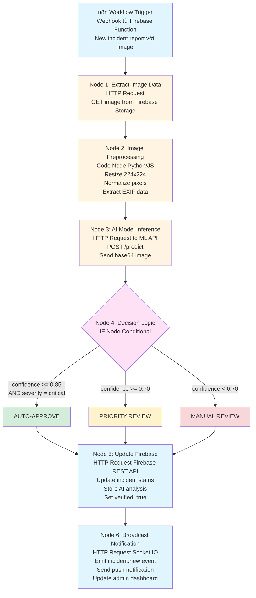
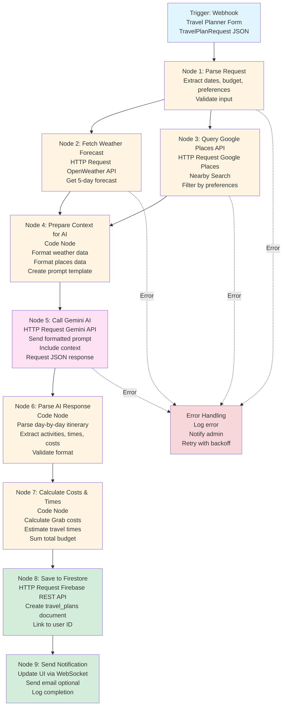
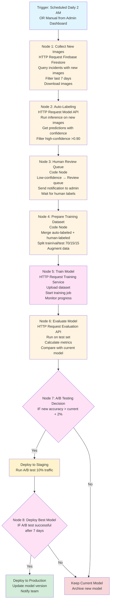

# n8n AI Workflow Diagrams - GrabTheBeyond

**Mục đích:** Sơ đồ chi tiết về cách sử dụng n8n để xây dựng AI workflows không cần code

---

## 📋 Mục Lục

1. [AI Image Classification Workflow](#ai-image-classification-workflow)
2. [Travel Plan Generation Agent](#travel-plan-generation-agent)
3. [Model Training Pipeline](#model-training-pipeline)
4. [Incident Auto-Verification Workflow](#incident-auto-verification-workflow)

---

## 🤖 AI Image Classification Workflow

### Tổng Quan

Workflow này tự động phân tích hình ảnh từ báo cáo sự cố, phân loại loại sự cố và mức độ nghiêm trọng, sau đó tự động duyệt hoặc gửi đến admin để xem xét.

### Sơ Đồ Workflow



### Chi Tiết Các Nodes

#### Node 1: Extract Image Data
```javascript
// n8n Code Node
const imageUrl = $input.item.json.imageUrl;
const incidentId = $input.item.json.incidentId;

return {
  json: {
    imageUrl,
    incidentId,
    timestamp: new Date().toISOString()
  }
};
```

#### Node 2: Image Preprocessing
```python
# n8n Python Code Node (hoặc HTTP request đến preprocessing service)
import base64
import requests
from PIL import Image
import io

def preprocess_image(image_url):
    # Download image
    response = requests.get(image_url)
    img = Image.open(io.BytesIO(response.content))
    
    # Resize và normalize
    img = img.resize((224, 224))
    # ... preprocessing logic
    
    return {
        'processed_image': base64.b64encode(img_bytes).decode(),
        'metadata': extract_metadata(img)
    }
```

#### Node 3: AI Model Inference
```javascript
// n8n HTTP Request Node
{
  "method": "POST",
  "url": "https://model-api.grabthebeyond.com/predict",
  "body": {
    "image": "{{ $json.processed_image }}",
    "metadata": "{{ $json.metadata }}"
  },
  "headers": {
    "Authorization": "Bearer {{ $env.MODEL_API_KEY }}"
  }
}
```

#### Node 4: Decision Logic
```javascript
// n8n IF Node Conditions
const confidence = $json.confidence;
const severity = $json.severity;

// Condition 1: Auto-approve
if (confidence >= 0.85 && severity === "critical") {
  return { route: "auto_approve" };
}

// Condition 2: Priority review
if (confidence >= 0.70) {
  return { route: "priority_review" };
}

// Default: Manual review
return { route: "manual_review" };
```

---

## 🧳 Travel Plan Generation Agent

### Tổng Quan

AI Agent tự động tạo kế hoạch du lịch dựa trên yêu cầu người dùng, sử dụng n8n để orchestrate các bước.

### Sơ Đồ Workflow



### Error Handling

```
┌─────────────────────────────────────────────────────────────────┐
│  ERROR HANDLING BRANCH                                          │
│  ┌──────────────────────────────────────────────────────────┐  │
│  │ IF any node fails:                                       │  │
│  │   1. Log error to monitoring service                     │  │
│  │   2. Send notification to admin                           │  │
│  │   3. Retry with exponential backoff (max 3 times)         │  │
│  │   4. If still fails: Return error to user                │  │
│  └──────────────────────────────────────────────────────────┘  │
└─────────────────────────────────────────────────────────────────┘
```

---

## 🎓 Model Training Pipeline

### Tổng Quan

Workflow tự động thu thập dữ liệu mới, gán nhãn, và retrain model để cải thiện độ chính xác.

### Sơ Đồ Workflow



---

## ✅ Incident Auto-Verification Workflow

### Chi Tiết Workflow

Workflow này kết hợp nhiều nguồn dữ liệu để tự động xác minh sự cố:

```
┌─────────────────────────────────────────────────────────────────┐
│  INPUT: New Incident Report                                      │
│  - Image, Location, Description, User Info                      │
└──────────────────────┬──────────────────────────────────────────┘
                       │
        ┌──────────────┼──────────────┐
        │              │              │
        ▼              ▼              ▼
┌──────────────┐ ┌──────────────┐ ┌──────────────┐
│ Image        │ │ Location     │ │ User         │
│ Analysis     │ │ Validation   │ │ Reputation   │
│ (AI Model)   │ │ (Weather API)│ │ (History)    │
└──────┬───────┘ └──────┬───────┘ └──────┬───────┘
       │                │                │
       └───────────────┼────────────────┘
                       │
                       ▼
┌─────────────────────────────────────────────────────────────────┐
│  NODE: Multi-Source Verification                                │
│  ┌──────────────────────────────────────────────────────────┐  │
│  │ Combine scores:                                           │  │
│  │ - AI confidence: 0.92                                     │  │
│  │ - Location match: 0.95 (weather confirms rain)          │  │
│  │ - User reputation: 0.88 (10 verified reports)           │  │
│  │                                                           │  │
│  │ Weighted score: 0.92 * 0.5 + 0.95 * 0.3 + 0.88 * 0.2   │  │
│  │ = 0.916 (91.6% confidence)                              │  │
│  └──────────────────────────────────────────────────────────┘  │
└──────────────────────┬──────────────────────────────────────────┘
                       │
                       ▼
┌─────────────────────────────────────────────────────────────────┐
│  DECISION: Auto-approve (confidence > 0.90)                    │
│  → Update status, broadcast, notify users                      │
└─────────────────────────────────────────────────────────────────┘
```

---

## 🔧 n8n Configuration

### Environment Variables

```bash
# API Keys
GOOGLE_PLACES_API_KEY=xxx
GEMINI_API_KEY=xxx
MODEL_API_KEY=xxx
FIREBASE_SERVICE_ACCOUNT=xxx

# Endpoints
MODEL_API_URL=https://model-api.grabthebeyond.com
FIREBASE_URL=https://firestore.googleapis.com/v1
SOCKET_IO_URL=https://backend.grabthebeyond.com
```

### Webhook URLs

- **Image Classification**: `https://n8n.grabthebeyond.com/webhook/incident-classify`
- **Travel Plan Generation**: `https://n8n.grabthebeyond.com/webhook/travel-plan`
- **Model Training**: `https://n8n.grabthebeyond.com/webhook/train-model`

---

## 📊 Monitoring & Analytics

### Metrics to Track

- Workflow execution time
- Success/failure rates
- AI model accuracy
- Cost per workflow execution
- User satisfaction scores

### Dashboards

- n8n execution dashboard
- Model performance dashboard
- Cost tracking dashboard

---

**Cập nhật lần cuối:** December 2025
