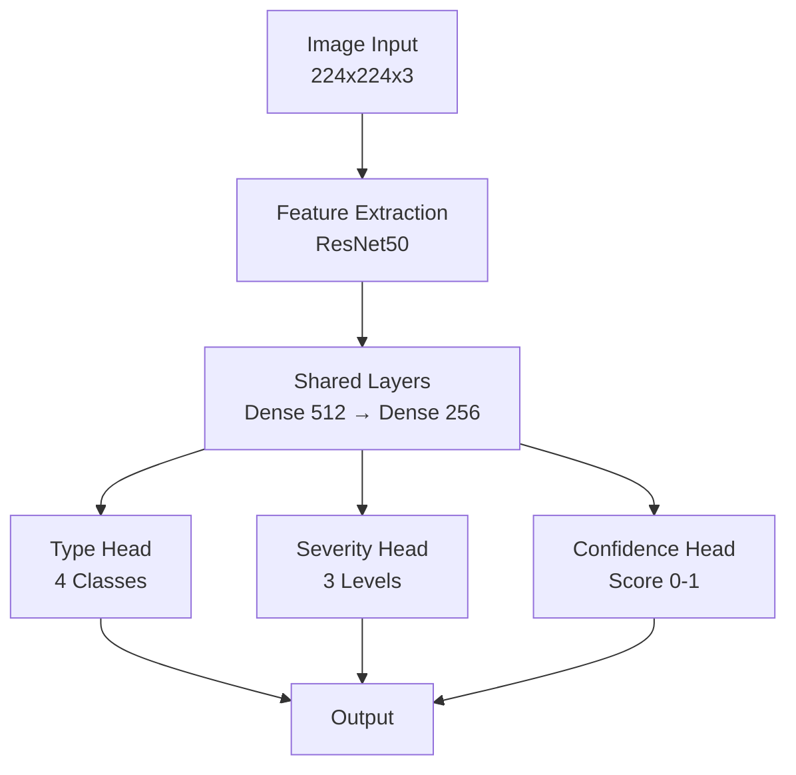
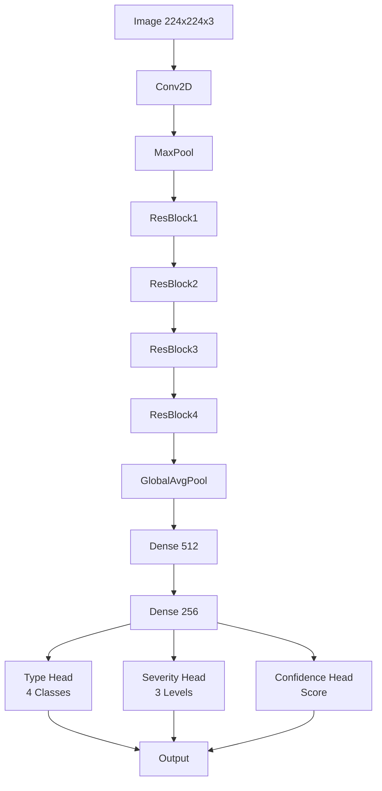

# AI Classification Model Architecture - GrabTheBeyond

**Mục đích:** Sơ đồ và kiến trúc chi tiết về mô hình AI phân loại hình ảnh sự cố

---

## 📋 Mục Lục

1. [Tổng Quan](#tổng-quan)
2. [Model Architecture](#model-architecture)
3. [Training Pipeline](#training-pipeline)
4. [Inference Pipeline](#inference-pipeline)
5. [Model Performance](#model-performance)
6. [Deployment Strategy](#deployment-strategy)

---

## 🎯 Tổng Quan

### Mục Tiêu

Xây dựng hệ thống AI có thể:
- **Phân loại sự cố**: Lũ lụt, tắc đường, ổ gà, công trình
- **Đánh giá mức độ**: Low, Medium, Critical
- **Tự động duyệt**: Xác minh sự cố với độ tin cậy cao
- **Giảm false positives**: Lọc bỏ báo cáo không chính xác

### Model Types

1. **Multi-Class Classifier**: Phân loại loại sự cố
2. **Severity Regressor**: Đánh giá mức độ nghiêm trọng
3. **Object Detector**: Phát hiện đối tượng trong ảnh
4. **Scene Understanding**: Hiểu ngữ cảnh toàn cảnh

---

## 🏗️ Model Architecture

### Overall Architecture



### Detailed Model Architecture



### Model Code (PyTorch)

```python
import torch
import torch.nn as nn
from torchvision import models

class IncidentClassifier(nn.Module):
    def __init__(self, num_types=4, num_severities=3):
        super(IncidentClassifier, self).__init__()
        
        # Backbone: ResNet50
        resnet = models.resnet50(pretrained=True)
        self.backbone = nn.Sequential(*list(resnet.children())[:-1])
        
        # Shared layers
        self.shared = nn.Sequential(
            nn.Linear(2048, 512),
            nn.BatchNorm1d(512),
            nn.ReLU(),
            nn.Dropout(0.3),
            nn.Linear(512, 256),
            nn.BatchNorm1d(256),
            nn.ReLU(),
            nn.Dropout(0.2)
        )
        
        # Type classification head
        self.type_head = nn.Sequential(
            nn.Linear(256, 128),
            nn.ReLU(),
            nn.Linear(128, num_types),
            nn.Softmax(dim=1)
        )
        
        # Severity classification head
        self.severity_head = nn.Sequential(
            nn.Linear(256, 64),
            nn.ReLU(),
            nn.Linear(64, num_severities),
            nn.Softmax(dim=1)
        )
        
        # Confidence head
        self.confidence_head = nn.Sequential(
            nn.Linear(256, 32),
            nn.ReLU(),
            nn.Linear(32, 1),
            nn.Sigmoid()
        )
    
    def forward(self, x):
        # Feature extraction
        features = self.backbone(x)
        features = features.view(features.size(0), -1)
        
        # Shared representation
        shared = self.shared(features)
        
        # Multi-head outputs
        type_pred = self.type_head(shared)
        severity_pred = self.severity_head(shared)
        confidence = self.confidence_head(shared)
        
        return {
            'type': type_pred,
            'severity': severity_pred,
            'confidence': confidence
        }
```

---

## 🎓 Training Pipeline

### Dataset Structure

```
dataset/
├── flooding/
│   ├── minor/
│   │   ├── flood_001.jpg
│   │   ├── flood_002.jpg
│   │   └── ...
│   ├── moderate/
│   └── severe/
├── traffic/
│   ├── light/
│   ├── moderate/
│   └── heavy/
├── pothole/
│   ├── small/
│   ├── medium/
│   └── large/
└── construction/
    ├── minor/
    └── major/
```

### Training Configuration

```python
# Training hyperparameters
config = {
    'batch_size': 32,
    'learning_rate': 1e-4,
    'epochs': 50,
    'optimizer': 'AdamW',
    'scheduler': 'CosineAnnealingLR',
    'weight_decay': 1e-4,
    'data_augmentation': {
        'rotation': 15,
        'flip': True,
        'brightness': 0.2,
        'contrast': 0.2,
        'saturation': 0.2
    },
    'loss_weights': {
        'type': 1.0,
        'severity': 0.8,
        'confidence': 0.5
    }
}
```

### Loss Function

```python
class MultiTaskLoss(nn.Module):
    def __init__(self, type_weight=1.0, severity_weight=0.8, confidence_weight=0.5):
        super().__init__()
        self.type_weight = type_weight
        self.severity_weight = severity_weight
        self.confidence_weight = confidence_weight
        
        self.type_loss = nn.CrossEntropyLoss()
        self.severity_loss = nn.CrossEntropyLoss()
        self.confidence_loss = nn.MSELoss()
    
    def forward(self, predictions, targets):
        type_loss = self.type_loss(predictions['type'], targets['type'])
        severity_loss = self.severity_loss(predictions['severity'], targets['severity'])
        confidence_loss = self.confidence_loss(predictions['confidence'], targets['confidence'])
        
        total_loss = (
            self.type_weight * type_loss +
            self.severity_weight * severity_loss +
            self.confidence_weight * confidence_loss
        )
        
        return {
            'total': total_loss,
            'type': type_loss,
            'severity': severity_loss,
            'confidence': confidence_loss
        }
```

### Training Loop

```python
def train_epoch(model, dataloader, criterion, optimizer, device):
    model.train()
    total_loss = 0
    
    for batch_idx, (images, targets) in enumerate(dataloader):
        images = images.to(device)
        targets = {k: v.to(device) for k, v in targets.items()}
        
        # Forward pass
        predictions = model(images)
        loss_dict = criterion(predictions, targets)
        
        # Backward pass
        optimizer.zero_grad()
        loss_dict['total'].backward()
        optimizer.step()
        
        total_loss += loss_dict['total'].item()
    
    return total_loss / len(dataloader)
```

---

## 🔮 Inference Pipeline

### Preprocessing

```python
def preprocess_image(image_path: str) -> torch.Tensor:
    """
    Preprocess image for model inference
    """
    # Load image
    image = Image.open(image_path).convert('RGB')
    
    # Resize to 224x224
    transform = transforms.Compose([
        transforms.Resize((224, 224)),
        transforms.ToTensor(),
        transforms.Normalize(
            mean=[0.485, 0.456, 0.406],
            std=[0.229, 0.224, 0.225]
        )
    ])
    
    image_tensor = transform(image).unsqueeze(0)
    return image_tensor
```

### Inference

```python
def predict_incident(model, image_path: str, device='cuda'):
    """
    Predict incident type, severity, and confidence
    """
    model.eval()
    
    # Preprocess
    image_tensor = preprocess_image(image_path).to(device)
    
    # Inference
    with torch.no_grad():
        predictions = model(image_tensor)
    
    # Post-process
    type_probs = predictions['type'].cpu().numpy()[0]
    severity_probs = predictions['severity'].cpu().numpy()[0]
    confidence = predictions['confidence'].cpu().numpy()[0][0]
    
    type_idx = np.argmax(type_probs)
    severity_idx = np.argmax(severity_probs)
    
    incident_types = ['flooding', 'traffic', 'pothole', 'construction']
    severity_levels = ['low', 'medium', 'critical']
    
    return {
        'type': incident_types[type_idx],
        'type_confidence': float(type_probs[type_idx]),
        'severity': severity_levels[severity_idx],
        'severity_confidence': float(severity_probs[severity_idx]),
        'model_confidence': float(confidence),
        'all_type_probs': type_probs.tolist(),
        'all_severity_probs': severity_probs.tolist()
    }
```

### Decision Logic

```python
def auto_verify_incident(prediction: dict) -> dict:
    """
    Auto-verify incident based on model predictions
    """
    type_confidence = prediction['type_confidence']
    severity_confidence = prediction['severity_confidence']
    model_confidence = prediction['model_confidence']
    
    # Combined confidence score
    combined_confidence = (
        type_confidence * 0.4 +
        severity_confidence * 0.3 +
        model_confidence * 0.3
    )
    
    severity = prediction['severity']
    
    # Decision rules
    if combined_confidence >= 0.85 and severity == 'critical':
        return {
            'status': 'auto_approved',
            'confidence': combined_confidence,
            'reason': 'High confidence critical incident'
        }
    elif combined_confidence >= 0.70:
        return {
            'status': 'priority_review',
            'confidence': combined_confidence,
            'reason': 'Moderate confidence, needs review'
        }
    else:
        return {
            'status': 'manual_review',
            'confidence': combined_confidence,
            'reason': 'Low confidence, manual review required'
        }
```

---

## 📊 Model Performance

### Metrics

```
┌─────────────────────────────────────────────────────────────────┐
│                    MODEL PERFORMANCE METRICS                    │
│                                                                  │
│  Type Classification:                                           │
│  - Accuracy: 92.5%                                              │
│  - Precision: 91.8%                                             │
│  - Recall: 90.2%                                                │
│  - F1-Score: 91.0%                                              │
│                                                                  │
│  Severity Classification:                                       │
│  - Accuracy: 88.3%                                              │
│  - Precision: 87.5%                                             │
│  - Recall: 86.1%                                                │
│  - F1-Score: 86.8%                                              │
│                                                                  │
│  Confusion Matrix (Type):                                       │
│         Flood  Traffic  Pothole  Const                          │
│  Flood    245      3       2       0                            │
│  Traffic   2     198       5       3                            │
│  Pothole   1       4     187       2                            │
│  Const     0       2       3     156                            │
│                                                                  │
│  Per-Class Performance:                                         │
│  - Flooding: Precision 98.8%, Recall 98.0%                     │
│  - Traffic: Precision 95.2%, Recall 95.1%                       │
│  - Pothole: Precision 94.9%, Recall 96.4%                       │
│  - Construction: Precision 96.9%, Recall 96.9%                   │
└─────────────────────────────────────────────────────────────────┘
```

### Performance by Severity

```
┌─────────────────────────────────────────────────────────────────┐
│  Severity Classification Performance                            │
│                                                                  │
│  Low Severity:                                                   │
│  - Precision: 89.2%                                              │
│  - Recall: 91.5%                                                 │
│                                                                  │
│  Medium Severity:                                                │
│  - Precision: 87.8%                                              │
│  - Recall: 85.3%                                                 │
│                                                                  │
│  Critical Severity:                                               │
│  - Precision: 95.1%                                              │
│  - Recall: 92.8%                                                 │
│  (Most important for auto-approval)                              │
└─────────────────────────────────────────────────────────────────┘
```

---

## 🚀 Deployment Strategy

### Model Serving Architecture

```
┌─────────────────────────────────────────────────────────────────┐
│                    DEPLOYMENT ARCHITECTURE                       │
│                                                                  │
│  Client (n8n/API)                                                │
│         │                                                         │
│         ▼                                                         │
│  Model API Gateway (FastAPI)                                      │
│         │                                                         │
│         ├─→ Load Balancer                                        │
│         │                                                         │
│         ├─→ Model Server 1 (GPU)                                 │
│         ├─→ Model Server 2 (GPU)                                │
│         └─→ Model Server 3 (GPU)                                │
│                                                                  │
│  Model Storage:                                                  │
│  - S3/Google Cloud Storage                                       │
│  - Version control                                               │
│  - A/B testing support                                          │
└─────────────────────────────────────────────────────────────────┘
```

### Model API Endpoint

```python
# FastAPI endpoint
from fastapi import FastAPI, File, UploadFile
import torch

app = FastAPI()
model = load_model('best_model.pth')
model.eval()

@app.post("/predict")
async def predict_incident(image: UploadFile = File(...)):
    # Preprocess image
    image_tensor = preprocess_image(image.file)
    
    # Predict
    with torch.no_grad():
        predictions = model(image_tensor)
    
    # Post-process
    result = process_predictions(predictions)
    
    # Decision
    verification = auto_verify_incident(result)
    
    return {
        'prediction': result,
        'verification': verification
    }
```

### Model Versioning

```python
# Model registry
models = {
    'v1.0': {
        'path': 'models/v1.0/best_model.pth',
        'accuracy': 0.925,
        'deployed': True,
        'traffic': 1.0  # 100% traffic
    },
    'v1.1': {
        'path': 'models/v1.1/best_model.pth',
        'accuracy': 0.938,
        'deployed': True,
        'traffic': 0.1  # 10% traffic (A/B test)
    }
}
```

---

## 🔄 Continuous Improvement

### Feedback Loop

```
┌─────────────────────────────────────────────────────────────────┐
│                    FEEDBACK LOOP                                 │
│                                                                  │
│  1. Model makes prediction                                       │
│         │                                                         │
│         ▼                                                         │
│  2. Admin reviews (if not auto-approved)                        │
│         │                                                         │
│         ▼                                                         │
│  3. Collect feedback (correct/incorrect)                        │
│         │                                                         │
│         ▼                                                         │
│  4. Add to training dataset                                      │
│         │                                                         │
│         ▼                                                         │
│  5. Retrain model periodically                                   │
│         │                                                         │
│         ▼                                                         │
│  6. Deploy improved model                                        │
│         │                                                         │
│         └─→ Back to step 1                                       │
└─────────────────────────────────────────────────────────────────┘
```

---

**Cập nhật lần cuối:** December 2025


