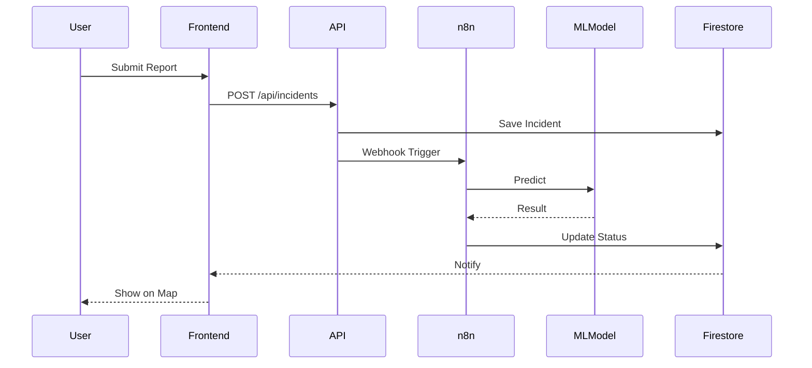
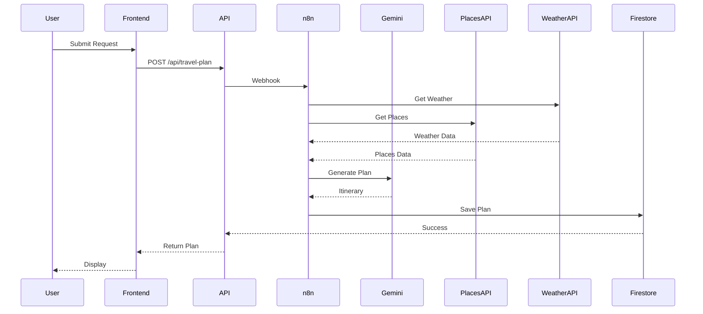
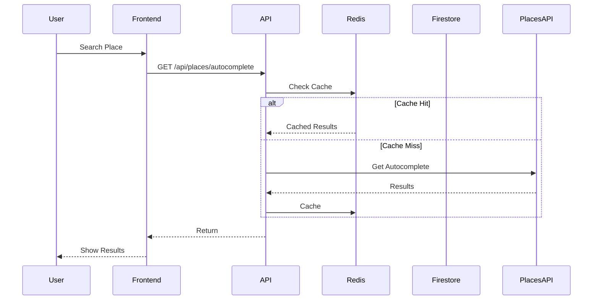
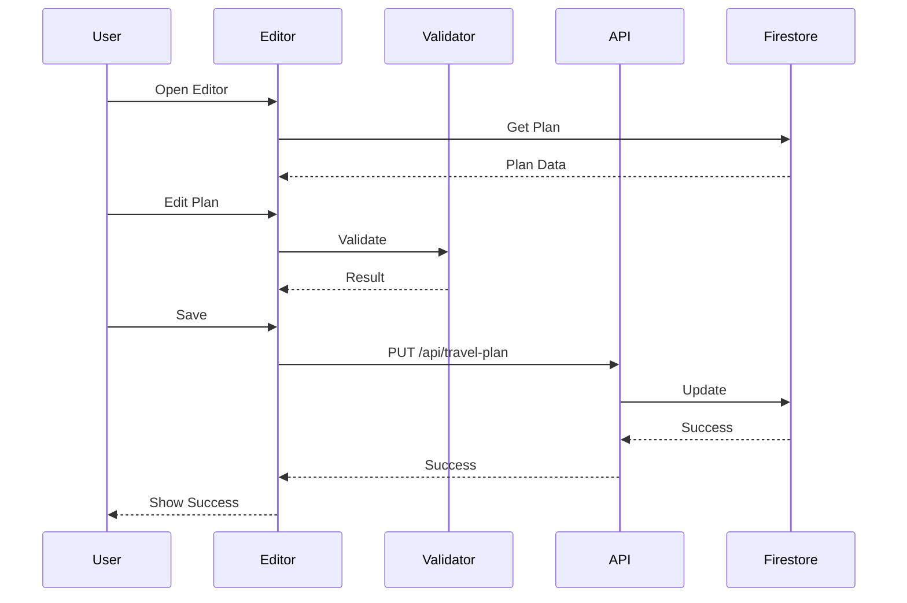
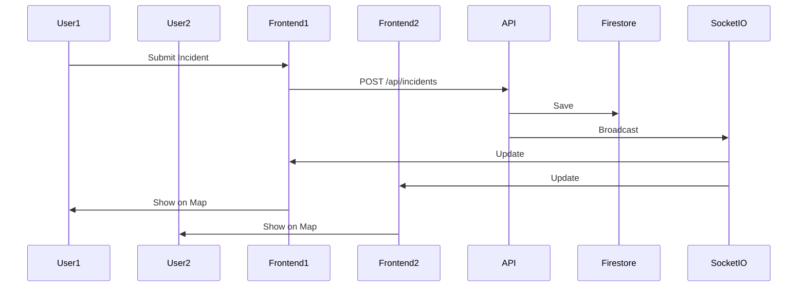
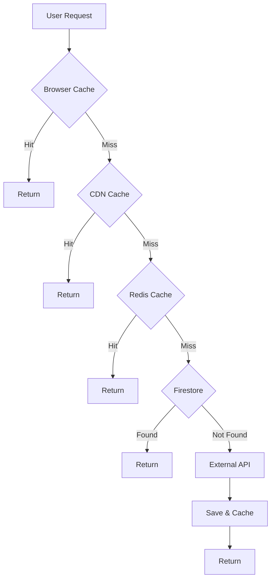
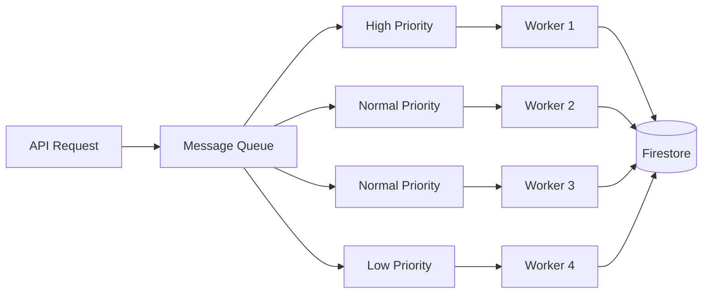
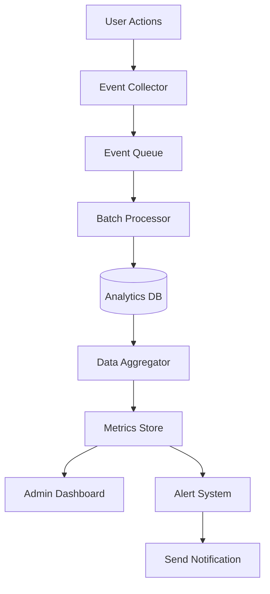

# Future Data Flow Diagrams - GrabTheBeyond

**Mục đích:** Sơ đồ luồng dữ liệu tương lai với AI và các tính năng mới

---

## 📋 Mục Lục

1. [AI Image Classification Data Flow](#ai-image-classification-data-flow)
2. [Travel Plan Generation Data Flow](#travel-plan-generation-data-flow)
3. [Google Places Integration Data Flow](#google-places-integration-data-flow)
4. [Plan Editing Data Flow](#plan-editing-data-flow)
5. [Real-Time Updates Data Flow](#real-time-updates-data-flow)

---

## 🤖 AI Image Classification Data Flow

### Data Flow Diagram

---

## 🧳 Travel Plan Generation Data Flow

### Data Flow Diagram

---

## 📍 Google Places Integration Data Flow

### Data Flow Diagram

---

## ✏️ Plan Editing Data Flow

### Data Flow Diagram

---

## 🔄 Real-Time Updates Data Flow

### Data Flow Diagram

---

## 🔄 Caching Strategy Data Flow

### Multi-Layer Cache Flow

---

## 🔄 Background Job Processing Flow

### Message Queue Processing

---

## 📊 Analytics Data Flow

### Data Collection and Analysis

---

**Cập nhật lần cuối:** December 2025
